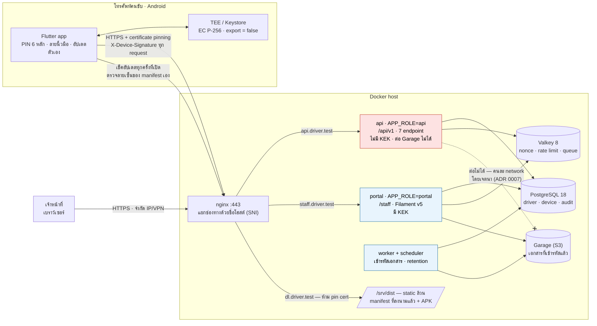
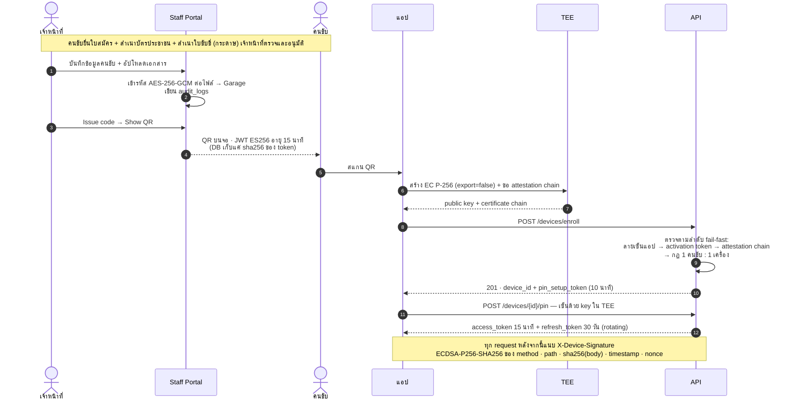

# mvp_mobile_sec1

ระบบลงทะเบียน **คนขับรถ** และ **อุปกรณ์** พร้อม API hardening สำหรับแอปรับงานส่งของบน Android
เจ้าหน้าที่เป็นผู้บันทึกคนขับเข้าระบบ · คนขับใช้แอปเพื่อรับงานส่งของ

**โจทย์ของระบบนี้:** ทำให้ API เชื่อได้ว่า request มาจาก *เครื่องที่ลงทะเบียนไว้จริง*
ทั้งที่แอป **ไม่ได้ขึ้น Play Store** (จึงใช้ Play Integrity ไม่ได้ — ADR 0003) และตัวแอปเอง
รันอยู่บนเครื่องของคนที่เราไม่ไว้ใจ คำตอบคือย้ายหลักฐานไปไว้ในที่ที่แอปปลอมไม่ได้:
**คู่กุญแจในชิปความปลอดภัยของเครื่อง (TEE)**

> **repo นี้เป็นตัวอย่างสำหรับศึกษาการทำงานของระบบ** ยังไม่ได้ปล่อยใช้กับคนขับจริง
>
> - **ไม่มีกุญแจจริงติดมากับ repo** — `make init` สุ่ม secret ของ dev ให้ใหม่ทุกเครื่อง
>   และทั้งหมดอยู่ใน `.gitignore` · ยังไม่มี production keystore (`.jks`) ถูกสร้างขึ้นเลย
> - **ค่าใน `.env` ที่ `make init` สร้างให้ ใช้กับ dev เท่านั้น** ห้ามยกไปใช้กับของจริงไม่ว่ากรณีใด
> - ถ้าจะต่อยอดไปใช้งานจริง อ่าน [`docs/adr/0008-no-ci-pipeline.md`](docs/adr/0008-no-ci-pipeline.md)
>   และ [`docs/security/threat-model.md`](docs/security/threat-model.md) ก่อน — มีข้อที่ต้องเตรียม
>   ก่อนเซ็น APK ดอกแรก ซึ่งแก้ย้อนหลังไม่ได้

---

## ภาพรวม



`api` กับ `portal` ใช้ **โค้ดเบสเดียวกันและ image เดียวกัน** ต่างกันที่ `APP_ROLE`,
secret ที่ mount และ network ที่ต่อได้ — service ที่เปิดสู่อินเทอร์เน็ตจึงไม่ถือกุญแจ
ที่ถอดสำเนาบัตรประชาชนได้ทั้งฐาน

---

## Trust model — อะไรเชื่อได้ อะไรเชื่อไม่ได้

เส้นแบ่งของระบบนี้อยู่ตรงที่ว่า **หลักฐานถูกสร้างที่ไหน** ไม่ใช่ว่าแอปรายงานอะไรมา

| ชั้น | กลไก | เชื่อได้ไหม | ใช้ทำอะไร |
|---|---|---|---|
| L1 | `X-App-Signature` เทียบ allowlist | **อ่อนมาก** — ค่าสาธารณะ | signal ตาม PRD §2.3 |
| L1.5 | แอปตรวจ root / emulator / hook เอง | **เชื่อไม่ได้** — Magisk ซ่อนได้ Frida hook ได้ | สถิติ + risk score เท่านั้น |
| **L2** | **Device keypair** EC P-256 ใน Keystore (StrongBox ถ้ามี) เซ็นทุก request | **แข็ง** — private key ออกจากเครื่องไม่ได้ | ตัวตนของเครื่อง |
| **L2.5** | **Android Key Attestation** — ตรวจ certificate chain ถึง root ของ Google | **แข็ง** — แอปไม่มีกุญแจของ TEE จึงปลอมไม่ได้ | พิสูจน์ว่าตัวตนนั้นอยู่ในฮาร์ดแวร์จริง |
| ~~L3~~ | ~~Play Integrity~~ | — | **ตัดถาวร** ต้องมี Play Console (ADR 0003) |

> **กฎที่ตามมา:** ห้ามเขียนโค้ดที่ block หรือ allow โดยดูจากผลตรวจที่แอปส่งมาอย่างเดียว
> และการตรวจ attestation ต้อง verify chain จริง ไม่ใช่อ่านค่าจาก JSON ที่แอปส่งมา

---

## Flow หลัก — จากกระดาษถึงเครื่องที่ใช้งานได้

การอนุมัติเกิดขึ้น **บนกระดาษ ก่อน** ข้อมูลจะเข้าระบบ ไม่มี self-registration ในระบบนี้เลย



**PIN คุมคนหยิบเครื่องไปใช้ ไม่ใช่คุมการส่งข้อมูล** — PIN 6 หลักมีแค่ 10⁶ ความเป็นไปได้
lockout จึงอยู่ที่ **server** (ผิด 5 ครั้งล็อก 15 นาที · สะสม 10 ครั้ง `blocked`)
ส่วนลายนิ้วมือเป็นแค่กุญแจเปิด refresh token ที่ seal ไว้ในเครื่อง **ไม่ใช่ปัจจัยยืนยันตัวตน** —
อำนาจตัดสินว่า session ยังใช้ได้ไหมอยู่ที่ server เสมอ

---

## สถานะ

รันได้ทั้งสแตกและมีของจริงครบสามฝั่งแล้ว — backend, Staff Portal และแอป Android
ทดสอบ enroll / ตั้ง PIN / ปลดล็อก / อัปเดตแอป บนเครื่องจริงแล้ว

| ส่วน | มีอะไรแล้ว |
|---|---|
| Data model | 12 migration · 10 model — driver, device, session, activation code, document, audit log, retention |
| API (`APP_ROLE=api`) | 7 endpoint — enroll, ตั้ง/ตรวจ PIN, ขอ setup token ใหม่, refresh, รายงานสภาพเครื่อง, health |
| Staff Portal | Filament v5 — ทะเบียนคนขับ + เอกสาร, activation code (Issue/Show QR/revoke), อุปกรณ์ (revoke/restore/reset PIN), audit log, ตั้งค่า retention |
| ความปลอดภัย | attestation chain verifier, envelope encryption, masking + step-up PIN, rate limit แยกราย endpoint, replay guard ด้วย nonce |
| แอป Android | สแกน QR, สร้าง key ใน TEE, เซ็น request, หน้าล็อก PIN, ปลดล็อกด้วยลายนิ้วมือ, certificate pinning, ตรวจ root/debugging, อัปเดตตัวเองผ่าน signed manifest |
| เทสต์ | 21 ไฟล์ฝั่ง API (รวมเทสต์ยืนยันว่า `APP_ROLE=api` ไม่มี KEK และ `/staff` ตอบ 404) · 5 ไฟล์ฝั่งแอป |

ยังไม่มี: ระบบมอบหมายงานส่งของ — อยู่นอกขอบเขต MVP

---

## เริ่มต้น

```bash
make init                # สร้าง .env + secret ของ dev (สุ่มให้อัตโนมัติ)
make up                  # เปิดทุก service
make composer c=install  # ติดตั้ง dependency — vendor/ ไม่ได้ commit
make migrate
make verify-isolation    # ยืนยันว่า api ไม่มี KEK และต่อ Garage ไม่ได้
```

ตรวจคุณภาพก่อนเปิด PR: `make lint` · `make analyse` · `make test` · `make secrets-scan`

สามช่องทางแยกด้วย **ชื่อโฮสต์คงที่** บนพอร์ต 443 (แยกด้วย SNI) ส่วน `:80` redirect ไป https
ชื่อไม่มี IP ในตัว → ย้ายที่เดโม่แล้วไม่ต้องแก้ cert / pin / build แอป

| | URL |
|---|---|
| API (แอปคนขับ) | `https://api.driver.test` |
| Staff Portal | `https://staff.driver.test/staff` |
| manifest + APK | `https://dl.driver.test` |
| Mailpit (dev) | http://localhost:8025 |

**resolve ชื่อ:**
- แล็ปท็อป → `make dev-hosts` แล้วเอาบรรทัดไปใส่ `/etc/hosts` (ครั้งเดียว ชี้ `127.0.0.1`)
- มือถือ → ตั้ง DNS ใน Wi-Fi ให้ชี้ IP แล็ปท็อป · service `dnsmasq` ในสแตกตอบ `*.driver.test`
- ย้ายที่ → แก้ `HOST_LAN_IP` ใน `.env` ตัวเดียว แล้ว `docker compose up -d dnsmasq`

cert ของ dev สร้างด้วย `./scripts/dev-tls.sh` (SAN เป็นชื่อ ไม่ใช่ IP จึงใช้ได้ทุกที่)

> **manifest/APK ต้องคนละชื่อโฮสต์กับ API เสมอ** — เป็นช่องทางกู้คืน ห้าม pin certificate
> ถ้า pin พังพร้อมกันทั้งคู่ แอปทั้งฐานจะแก้ไม่ได้เลย (`docs/architecture.md` §11.5)

`make help` ดูคำสั่งทั้งหมด

---

## สิ่งที่ต้องรู้ก่อนแตะโค้ด

อ่าน **[CLAUDE.md](CLAUDE.md)** ก่อน — เป็นกฎบังคับของโปรเจกต์ ไม่ใช่คำแนะนำ

สี่ข้อที่พลาดบ่อยที่สุด

1. **artisan ที่เขียนลง `storage/` ต้องรันเป็น `www-data`**
   `docker exec` เข้าเป็น root แต่ php-fpm worker เป็น www-data → ไฟล์ที่ root สร้าง worker แตะไม่ได้ → `500 touch(): Utime failed`
   ใช้ `make` แทนการพิมพ์ `docker compose exec` เอง — ห่อ `-u www-data` ไว้ให้แล้วทุกตัว

2. **`api` กับ `portal` เป็นคนละ container โดยเจตนา**
   `api` เปิดสู่อินเทอร์เน็ต จึง **ไม่มี `DOCUMENT_KEK` และต่อ Garage ไม่ได้ในระดับเครือข่าย**
   ถ้าโค้ดฝั่ง API ต้องใช้ของพวกนี้ แปลว่าออกแบบผิด → ย้ายงานไป `worker`
   ตรวจด้วย `make verify-isolation` หลัง recreate container ทุกครั้ง

3. **ใช้ Valkey ไม่ใช่ Redis**
   ext-redis และ driver `redis` ของ Laravel ใช้ได้ตรงๆ (โปรโตคอลเข้ากันได้) แต่ service ชื่อ `valkey`

4. **งานเจ้าหน้าที่ไม่ใช่ REST API**
   ทุกอย่างในหน้าเจ้าหน้าที่ทำผ่าน Filament (Livewire) ไม่มี endpoint `/admin/*`
   API ที่มีจริงมีแค่ 7 เส้นสำหรับแอปคนขับ — ดู [`docs/api/openapi.yaml`](docs/api/openapi.yaml)

---

## เอกสาร

| ไฟล์ | เนื้อหา |
|---|---|
| [`PRD.md`](PRD.md) | ข้อกำหนดจากลูกค้า — **ห้ามแก้** |
| [`CLAUDE.md`](CLAUDE.md) | กฎการทำงาน: ภาษา / git / version / docker / security |
| [`docs/architecture.md`](docs/architecture.md) | เอกสารออกแบบฉบับเต็ม 15 หัวข้อ + diagram |
| [`docs/api/openapi.yaml`](docs/api/openapi.yaml) | **source of truth** ของ API contract |
| [`docs/security/threat-model.md`](docs/security/threat-model.md) | 17 สถานการณ์การโจมตี + มาตรการ + ความเสี่ยงที่เหลือ |
| [`docs/adr/`](docs/adr/) | บันทึกการตัดสินใจเชิงสถาปัตยกรรม 8 ฉบับ |
| [`docs/runbook/`](docs/runbook/) | ขั้นตอนปฏิบัติ — certificate pinning, nginx ของ prod |
| [`CHANGELOG.md`](CHANGELOG.md) | Keep a Changelog |

---

## Stack

Laravel 13 · PHP 8.4 · PostgreSQL 18 · Valkey 8 · Garage (object storage) · Filament v5 · Flutter (Android)

**Flutter ไม่ build ใน Docker** — release signing ต้องใช้ `.jks` ซึ่งห้ามเข้า image layer (ADR 0002)
ติดตั้ง Flutter SDK บนเครื่องเอง · **release build ต้องทำบนเครื่องที่เก็บ `.jks` ไว้เท่านั้น**

| service | หน้าที่ | `DOCUMENT_KEK` | ต่อ Garage |
|---|---|---|---|
| `nginx` | reverse proxy, แยก 3 ช่องทางด้วยชื่อโฮสต์ | ❌ | ❌ |
| `api` | `/api/v1` ให้แอปคนขับ | **❌** | **❌** |
| `portal` | `/staff` ให้เจ้าหน้าที่ | ✅ | ✅ |
| `worker` | queue — งานเอกสาร/เข้ารหัส | ✅ | ✅ |
| `scheduler` | retention, manifest, แจ้งเตือน | ❌ | ✅ |
| `postgres` | ฐานข้อมูล | — | — |
| `valkey` | nonce, rate limit, cache, queue | — | — |
| `garage` | object storage (เอกสารเข้ารหัสแล้ว) | — | — |

`mailpit` และ `dnsmasq` เพิ่มเฉพาะ dev

---

## ขอบเขตที่ MVP นี้ไม่ทำ

ไม่ใช่เพราะลืม แต่ตัดสินใจแล้วและมีเหตุผลบันทึกไว้

- **iOS** — MVP ทำ Android อย่างเดียว
- **โหมดออฟไลน์** — แอปต้องมีเน็ต
- **Play Integrity** — ทำไม่ได้ทางเทคนิค ต้องมี Play Console (ADR 0003)
  ความเสี่ยงเรื่องแอปถูก hook ด้วย Frida เป็นความเสี่ยงถาวรที่ลูกค้ารับทราบแล้ว
- **การบังคับ attestation** — MVP รันแบบ monitor mode (บันทึก + แจ้งเตือน แต่ยังให้ enroll ผ่าน)
  สลับเป็นบังคับด้วย feature flag ฝั่ง server ได้โดยไม่ต้องปล่อยแอปใหม่
- **ระบบมอบหมายงานส่งของ** — อยู่นอกขอบเขต งานนี้ทำเฉพาะชั้นลงทะเบียนและความปลอดภัย
