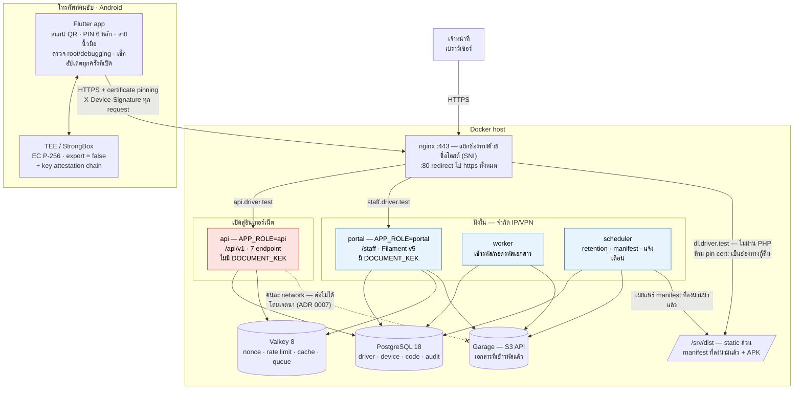
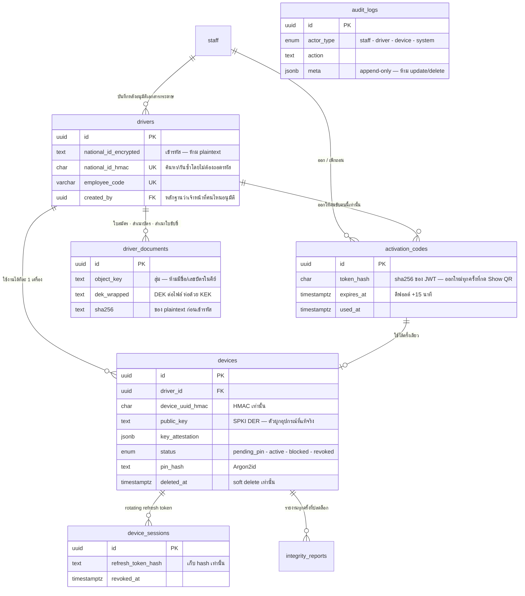
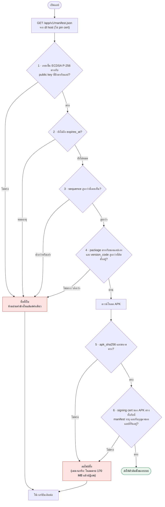

# เอกสารออกแบบ — Mobile & API Security Hardening (MVP)

| | |
|---|---|
| อ้างอิง | `PRD.md` |
| สถานะ | ฉบับร่างเพื่อทบทวน (ยังไม่มีการ implement) |
| วันที่ | 2026-07-22 |
| Stack | Laravel 13 / PHP 8.4 / PostgreSQL 18 / Valkey 8 / Flutter |
| Deployment | Docker (backend + infra) — Flutter build นอก Docker |

---

## 1. ขอบเขต

**คนขับรถ** มาสมัครและนำอุปกรณ์มาลงทะเบียน ระบบผูกคนขับ ↔ อุปกรณ์ ↔ กุญแจในฮาร์ดแวร์เข้าด้วยกัน
หลังลงทะเบียนสำเร็จ อุปกรณ์นั้นเท่านั้นที่คุยกับ API ได้ และคนขับปลดล็อกด้วย PIN 6 หลัก

ผู้ใช้ระบบมี 2 กลุ่ม

| กลุ่ม | ทำอะไร | เข้าทางไหน |
|---|---|---|
| **เจ้าหน้าที่** (`staff`) | ตรวจเอกสารใบสมัคร, **กรอกข้อมูลคนขับเข้าระบบ**, อัปโหลดเอกสาร, ออก/เพิกถอน activation code, รับแจ้งเครื่องหาย, รีเซ็ต PIN | Staff Portal (เว็บ) |
| **คนขับรถ** (`driver`) | สแกน QR ลงทะเบียนอุปกรณ์ของตัวเอง, ตั้ง/ใช้ PIN, **เข้าแอปเพื่อรับงานส่งของ** | แอป Flutter |

### 🔴 คนขับไม่เคยกรอกข้อมูลตัวเองเข้าระบบ

กระบวนการรับสมัครเป็น **กระดาษก่อน แล้วเจ้าหน้าที่เป็นคนบันทึก**

```
คนขับยื่นใบสมัคร + สำเนาบัตรประชาชน + สำเนาใบขับขี่
   └─► เจ้าหน้าที่ตรวจเอกสาร
          ├─ ไม่อนุมัติ → จบ (ไม่มีข้อมูลเข้าระบบเลย)
          └─ อนุมัติ    → เจ้าหน้าที่กรอกข้อมูลคนขับ + อัปโหลดเอกสารเข้าระบบ
                          └─► ออก activation code → คนขับสแกน QR ลงทะเบียนเครื่องตัวเอง
```

ผลที่ตามมาในเชิงออกแบบ: **ไม่มี self-registration, ไม่มีสถานะ `pending_approval`, ไม่มี endpoint อนุมัติ**
เพราะการอนุมัติเกิดขึ้นบนกระดาษ *ก่อน* ข้อมูลจะเข้าระบบ — คนขับที่มีอยู่ในระบบคือคนที่ผ่านการอนุมัติแล้วเสมอ

**คนขับ 1 คน : อุปกรณ์ 1 เครื่อง** — เปลี่ยนมือถือต้องมาแจ้งเจ้าหน้าที่ให้ลบเครื่องเก่าออกก่อน (§6.6)

**อยู่ในขอบเขต:** ทะเบียนคนขับ + จัดเก็บเอกสาร, Staff Portal, device enrollment, PIN, การพิสูจน์ตัวตนของ request, การตรวจสภาพเครื่อง (root/emulator), เครื่องหาย/เปลี่ยนมือถือ, รีเซ็ต PIN, audit log

**ไม่อยู่ในขอบเขต MVP:** **iOS** (Android เท่านั้น), **โหมดออฟไลน์** (แอปต้องมีเน็ต), ระบบรับงานส่งของหลังผ่านหน้า PIN, การมอบหมายงาน/เส้นทางเดินรถ, การชำระเงิน, push notification

---

## 2. ⚠️ ช่องว่างของ PRD

`PRD.md` มี 50 บรรทัด และ **จบกลางประโยคที่ §3** (บรรทัด 51 ตัดกลาง diagram ไม่มี closing fence) ไม่มี §4 เป็นต้นไป

### 2.1 สิ่งที่ PRD ไม่ได้ระบุ

#### ✅ ได้คำตอบแล้ว (2026-07-22)

| หัวข้อ | คำตอบจากเจ้าของงาน | ออกแบบไว้ที่ |
|---|---|---|
| **ตัวตนของผู้ใช้** | มี 2 กลุ่ม — **เจ้าหน้าที่** และ **คนขับรถ** | §1, §5 |
| **ช่องทางลงทะเบียน** | คนขับยื่นเอกสารเฉยๆ **เจ้าหน้าที่ตรวจแล้วเป็นคนกรอกเข้าระบบ** ไม่มี self-registration | §1, §6.2 |
| **เอกสารที่ต้องเก็บ** | ใบสมัคร + สำเนาบัตรประชาชน + สำเนาใบขับขี่ **เข้ารหัสตามมาตรฐาน** | §5 (`driver_documents`), §8 |
| **ที่เก็บเอกสาร** | **object storage แยกต่างหาก — Garage** | §8, ADR 0004–0005 |
| **คนขับ : อุปกรณ์** | **1 : 1** เปลี่ยนมือถือต้องแจ้งเจ้าหน้าที่ลบเครื่องเก่าก่อน | §5, §6.6 |
| **หน้าที่ของคนขับในแอป** | เข้าแอปเพื่อ**รับงานส่งของ**เท่านั้น | §1 |
| **แพลตฟอร์ม** | **Android เท่านั้นใน MVP** ยังไม่ทำ iOS | §1, §11 |
| **โหมดออฟไลน์** | **ยังไม่ทำใน MVP** — แอปต้องมีเน็ต | §1 |
| **เครื่องหาย** | เจ้าหน้าที่รับเรื่อง → ลบอุปกรณ์ออก → ลงทะเบียนใหม่ | §6.6 |
| **ลืม PIN** | เจ้าหน้าที่รีเซ็ตให้ได้ | §6.7 |
| **ฟิลด์ข้อมูลคนขับ** | มี **`employee_code`** · ไม่มีทะเบียนรถ (อนาคต) · ไม่มีสังกัด | §5 |
| **แสดง/ดูข้อมูลส่วนบุคคล** | mask เป็นค่าเริ่มต้น + สิทธิ์ + **step-up PIN 10 นาที** + เก็บประวัติทุกครั้ง | §9 |
| **Retention** | ผู้ดูแลตั้งค่าผ่าน GUI ใช้ค่าเริ่มต้นที่เสนอไปก่อน | §10 |
| **แจกจ่าย/อัปเดตแอป** | sideload + **signed manifest** เช็คทุกครั้งที่เปิด | §11, ADR 0006 |
| **ตรวจสภาพเครื่อง** | **Android Key Attestation** ตรวจฝั่ง server — MVP รัน monitor mode ก่อน | §4.2, ADR 0003 |
| **Staff Portal** | **Filament** (fallback Blade + Livewire) | §3 |

#### ⏳ ยังไม่ได้คำตอบ — ไม่บล็อกการเริ่มพัฒนา

| หัวข้อ | คำถาม | ผลถ้าไม่ตอบ |
|---|---|---|
| **เปลี่ยน signing key ของแอป** | ถ้าออก release ด้วย key ใหม่ เครื่องเก่าทั้งหมดจะโดน `403` พร้อมกัน | ระบบล่มทั้งฐานผู้ใช้ในวันปล่อยแอป — **แนวทางกันไว้แล้วที่ §6.8** ยังไม่ต้องตัดสินใจตอนนี้ |
| **ปริมาณ / SLA** | คนขับกี่คน กี่ request/วินาที ต้อง HA ไหม | MVP สมมติ compose ชุดเดียวพอ (§14) ปรับทีหลังได้ |

### 2.2 จุดที่ PRD ออกแบบผิดหลักการ

#### (ก) `X-App-Signature` (PRD §2.3) ไม่ใช่กลไกความปลอดภัย

SHA-256 fingerprint ของ signing certificate เป็น **ค่าสาธารณะ** — ใครก็ดึงจาก APK ที่เผยแพร่แล้วได้ด้วย
```
apksigner verify --print-certs app-release.apk
```
การส่งเป็น static header จึงเท่ากับส่งค่าคงที่ที่ attacker คัดลอกได้ทันที ไม่ได้พิสูจน์อะไรเลยว่า request มาจากแอปตัวจริง

**ไม่ตัดทิ้ง** — ทำตาม PRD ครบ แต่จัดชั้นให้ถูก (§4)

#### (ข) "Hardware UUID" (PRD §3) ไม่มีอยู่จริงบนมือถือปัจจุบัน

- **Android**: ตัดการเข้าถึง IMEI/serial ตั้งแต่ API 29 (Android 10); `ANDROID_ID` reset เมื่อ factory reset และผูกกับ signing key + user profile

→ **UUID ใช้เป็นตัวผูกอุปกรณ์ไม่ได้** ต้องใช้ private key ที่สร้างใน hardware keystore แทน (§4 L2)
UUID ยังเก็บอยู่ แต่เป็น **secondary signal** ไว้ดูการโคลน/ย้ายเครื่อง เท่านั้น

#### (ค) Root detection ฝั่ง client (PRD §2.2) bypass ได้

Magisk Hide / Zygisk / Frida ทำให้ผลตรวจฝั่ง client เชื่อไม่ได้
ต้อง **ส่งผลขึ้น server เสมอ** ไม่งั้นเราจะไม่มีวันรู้ว่ามีคนพยายาม bypass

**สถานะ:** `apps/mobile/android/.../IntegritySignals.kt` ตรวจ 4 อย่างแล้ว
ส่งขึ้น server ตอน enroll และแสดงบนหน้าจอแอปด้วย (ตรวจแล้วไม่บอกใคร = เท่ากับไม่ได้ตรวจ)

| signal | วิธีตรวจ |
|---|---|
| `rooted` | ไฟล์ `su` ตามพาธมาตรฐาน · artifact ของ Magisk · `Build.TAGS` มี `test-keys` · `which su` |
| `hook_framework_detected` | ชื่อ library ใน `/proc/self/maps` · พอร์ต 27042 ของ frida-server · คลาส Xposed/Substrate ใน stack trace |
| `emulator` | `Build.FINGERPRINT` / `MODEL` / `PRODUCT` / `HARDWARE` |
| `debugger_attached` | `Debug.isDebuggerConnected()` |
| `developer_options` | `Settings.Global.DEVELOPMENT_SETTINGS_ENABLED` |
| `usb_debugging` | `Settings.Global.ADB_ENABLED` |
| `wireless_debugging` | `Settings.Global` คีย์ `adb_wifi_enabled` (Android 11+) |

**ข้อขัดแย้งกับ PRD §2.2 — ตัดสินใจแล้ว: แยกเป็นสองระดับ**

PRD §2.2 เขียนว่าพบ root แล้วให้ปิดแอป แต่ `CLAUDE.md` §6 ห้าม block จาก `IntegritySignals`
อย่างเดียว ผู้ตัดสินใจเลือกทางกลาง โดยแยกตาม**สิ่งที่คนขับแก้เองได้หรือไม่ได้**

| ระดับ | signal | แอปทำอะไร |
|---|---|---|
| **ปิดแอป** | `rooted` `su_binary_found` `test_keys` `hook_framework_detected` `emulator` | ปุ่มเดียวคือ *ปิดแอป* + บอกให้ติดต่อเจ้าหน้าที่ |
| **เตือน** | `usb_debugging` `wireless_debugging` `developer_options` `debugger_attached` | บอกขั้นตอนปิด + ปุ่ม *ตรวจอีกครั้ง* และ *ใช้งานต่อ* |

**เจอ fatal แม้ข้อเดียว = ปิดแอป** ต่อให้มี signal ระดับเตือนปนอยู่กี่ข้อก็ตาม
ส่วน *ใช้งานต่อ* มีผลเฉพาะรอบนั้น เปิดแอปใหม่ต้องตรวจใหม่

เหตุผลที่แบ่งแบบนี้: debugging เป็นการตั้งค่าที่คนขับปิดเองได้ใน 4 ขั้นตอน การปิดแอปทิ้ง
จึงเป็นการขวางงานโดยไม่จำเป็น ส่วน root/hook คนขับแก้เองไม่ได้ บอกให้ไปกดปิดอะไรก็เสียเวลาเปล่า

**ข้อจำกัดที่ยังอยู่:** signal ทุกตัวปลอมได้ คนที่ตั้งใจโจมตีจะ patch เช็คทิ้งและไม่เห็นหน้านี้เลย
สิ่งที่หน้านี้ทำได้จริงคือคุมเครื่องที่รายงานตามตรงให้อยู่ในสภาพที่รู้แน่ ไม่ใช่การป้องกันเชิงเทคนิค
การตัดสินใจ block ที่มีน้ำหนักยังเป็นของ server ซึ่งดูจาก `key_attestation` เป็นหลัก (§4.2)

**ผลข้างเคียงที่ยอมรับ:** เครื่องที่ถูกปิดแอปจะ enroll ไม่ได้และรายงานขึ้น server ไม่ได้
เจ้าหน้าที่จึงไม่เห็นสถิติว่ามีคนพยายามใช้เครื่อง root กี่ครั้ง — แลกกับการที่เครื่องนั้นใช้งานไม่ได้เลย

**เพดานคะแนน:** `AttestationVerifier` จำกัดคะแนนรวมจาก signal ที่ client รายงานไว้ที่ **40**
ซึ่งต่ำกว่าเกณฑ์ block (50) — ทำให้ signal ที่ปลอมได้ **ไม่มีทางดันถึงเกณฑ์ block ได้เอง**
ไม่ว่าจะเพิ่ม signal อีกกี่ตัวก็ตาม (เดิมพึ่งการนับว่ามีไม่กี่ตัว ซึ่งพังทันทีที่เพิ่มตัวที่ห้า)

---

## 3. ภาพรวมสถาปัตยกรรม



**อ่านรูปนี้ยังไง:** กล่องแดงคือส่วนเดียวที่อินเทอร์เน็ตเข้าถึงได้ และเป็นส่วนที่ **ไม่ถือกุญแจ**
ที่ถอดเอกสารได้ · เส้นประกากบาทคือข้อห้ามที่บังคับด้วย network ไม่ใช่ด้วยวินัยของคนเขียนโค้ด

**API กับ Staff Portal แยกเป็นคนละ container** (ADR 0007) โดยใช้ **โค้ดเบสเดียวกัน** ต่างกันที่
env, secret ที่ mount, network ที่ต่อได้ และ route ที่ลงทะเบียน (§12.2)

เหตุผลหลัก: **แอปคนขับไม่เคยดาวน์โหลดเอกสาร** มีแต่เจ้าหน้าที่ที่ดู
→ `DOCUMENT_KEK` จำเป็นเฉพาะฝั่ง Portal
→ service ที่เปิดสู่อินเทอร์เน็ตจึง **ไม่ต้องถือกุญแจที่ถอดสำเนาบัตรประชาชนได้ทั้งฐาน**

**เอกสารไม่เก็บในฐานข้อมูล และไม่เก็บบน filesystem ของ container** — เก็บใน **Garage** (object storage ที่พูด S3 API)
โดยเข้ารหัสก่อนอัปโหลดเสมอ (§8) ฐานข้อมูลเก็บแค่ metadata + object key

**Staff Portal — ✅ Filament v5** *(ตรวจสอบแล้ว 2026-07-22)*

`filament/support` **v5.7.2** (ปล่อย 2026-07) require `illuminate/contracts: ^11.28|^12.0|^13.0` และ `php: ^8.2`
→ **รองรับ Laravel 13 และ PHP 8.4 แล้ว ไม่ต้องถอยเวอร์ชันอะไรทั้งนั้น**

ให้ pin เป็น `filament/filament:^5.7` และยืนยันด้วย `composer require` จริงตอนเริ่มโปรเจกต์อีกครั้ง

**นโยบายถ้าอนาคตชนกัน:** เจ้าของงานกำหนดว่า **Filament เป็นตัวตั้ง** — ถ้าเวอร์ชันไหนของ Filament
ไม่รองรับ Laravel ที่ใช้อยู่ **ให้ถอย Laravel ลงมาให้เข้ากัน** ไม่ใช่ทิ้ง Filament

หน้าจอที่ต้องมีใน MVP: ทะเบียนคนขับ (+อัปโหลดเอกสาร), ออก/เพิกถอน activation code, รายการอุปกรณ์ (ลบ/รีเซ็ต PIN), audit log, ตั้งค่า retention

---

## 4. Trust Model

| ชั้น | กลไก | ตอบคำถามว่า | ตรวจที่ไหน | สถานะ |
|---|---|---|---|---|
| **L1** | `X-App-Signature` เทียบ allowlist → `403` | "แอปอ้างว่าเซ็นด้วย key นี้" | server แต่ค่ามาจาก client | **อ่อนมาก** — ค่าสาธารณะ ทำตาม PRD §2.3 ในฐานะ signal |
| **L1.5** | ผลตรวจ root/emulator/hook ฝั่งแอป | "แอปอ้างว่าเครื่องปกติ" | **บนเครื่องผู้ใช้** | **เชื่อไม่ได้** — เก็บเป็นสถิติ ไม่ใช้ตัดสินใจเดี่ยว |
| **L2** | **Device keypair** EC P-256 ใน Android Keystore (StrongBox ถ้ามี) `export = false` → เซ็นทุก request | "request นี้มาจากเครื่องที่ลงทะเบียนไว้จริง" | server | **แข็ง** — private key ออกจากเครื่องไม่ได้ |
| **L2.5** | **Android Key Attestation** — ตรวจ certificate chain + `verifiedBootState` | "เครื่องนี้ bootloader ล็อกอยู่และ boot ด้วยระบบที่ผู้ผลิตเซ็น" | **server ตรวจใบรับรองที่ TEE เซ็น** | **แข็ง — แอปปลอมไม่ได้** ✅ **ทำใน MVP** |
| ~~**L3**~~ | ~~Play Integrity~~ | "แอปเป็นตัวจริงบนเครื่องที่ไม่ถูกดัดแปลง" | server | **❌ ทำไม่ได้ — ต้องมี Play Console (ADR 0003)** |

สามคำที่ปรากฏในกล่องฝั่งแอป (TEE + Mobile APP) ของไดอะแกรมภาพรวม แยกหน้าที่กันดังนี้

- **Device Keypair** — คู่กุญแจ EC P-256 ที่เครื่องสร้างตอน enroll โดย private key ถูกสร้างและอยู่ใน TEE ตลอด เอาออกมาไม่ได้ (`export = false`) server เก็บแค่ public key ไว้ตรวจลายเซ็น → นี่คือ **"ตัวตนของเครื่อง"** (L2)
- **Key Attestation** — ใบรับรอง (certificate chain) ที่ TEE/StrongBox เซ็นและสืบสาวถึง root ของ Google ยืนยันว่า private key ข้างบนอยู่ในฮาร์ดแวร์จริง พร้อมสภาพเครื่อง (`verifiedBootState` ฯลฯ) แอปปลอมไม่ได้เพราะไม่มีกุญแจของ TEE → **พิสูจน์ว่าตัวตนนั้นอยู่ในฮาร์ดแวร์จริง** ใช้ตอน enroll (L2.5, ดู §4.2)
- **Signed Request** — ทุก request ที่แอปยิงมาเซ็นด้วย private key ใน TEE (`X-Device-Signature`) server ตรวจกับ public key ที่เก็บไว้ → **ใช้ตัวตนนั้นเซ็นทุกครั้งที่ใช้งาน** กัน replay/ปลอม (ดู §5)

> สรุป: **Keypair** = ตัวตนของเครื่อง · **Attestation** = พิสูจน์ว่าตัวตนอยู่ในฮาร์ดแวร์จริง (ตอน enroll) · **Signed Request** = ใช้ตัวตนนั้นเซ็นทุก request (ตอนใช้งาน)

### 4.1 ทำไมการตรวจ root ฝั่งแอปถึงเชื่อไม่ได้ (L1.5)

แอป **ตรวจ root ได้จริง** และเราก็ทำอยู่ ปัญหาคือโค้ดที่ตรวจ **รันอยู่บนเครื่องของคนที่เราไม่ไว้ใจ**
เขาจึงคุมคำตอบได้ทั้งหมด

| วิธีเลี่ยง | ทำอะไร |
|---|---|
| Magisk Hide / Zygisk | ซ่อน su binary และร่องรอย root จากแอปที่ระบุ |
| Frida / Xposed | hook ฟังก์ชันตรวจให้คืน `false` เสมอ โดยไม่ต้องแตะโค้ดตรวจเลย |
| แก้ APK แล้วเซ็นใหม่ | ตัดโค้ดตรวจทิ้งทั้งก้อน |

เทียบให้เห็นภาพ: เหมือนถามผู้ต้องสงสัยว่า "คุณเป็นคนร้ายไหม" — ถามได้ เขาโกหกได้ และเราไม่มีทางตรวจคำตอบ

**ยังคุ้มที่จะทำ** เพราะจับผู้ใช้ที่ root เครื่องแบบไม่ได้ตั้งใจซ่อนได้เกือบทั้งหมด (ซึ่งเป็นส่วนใหญ่ในความเป็นจริง)
และทำให้คนที่ตั้งใจจะเลี่ยงต้องลงแรงมากขึ้น **แต่ห้ามนับเป็นเส้นแบ่งความปลอดภัย** และห้ามให้แอปตัดสินใจเองฝ่ายเดียว —
ต้องส่งผลขึ้น server เสมอ ไม่งั้นเราจะไม่มีวันรู้ว่ามีคนพยายามเลี่ยง

### 4.2 ✅ Android Key Attestation — ตัวที่ตรวจได้จริงโดยไม่ต้องพึ่ง Play Store

นี่คือคำตอบของคำถาม "แล้วตรวจ device ไม่ได้เลยหรือ" — **ตรวจได้ ถ้าให้ฮาร์ดแวร์เป็นคนตอบแทนแอป**

ตอนแอปสร้าง keypair ใน Keystore สามารถขอ **attestation certificate chain** ได้
chain นี้ **TEE/StrongBox ของเครื่องเป็นคนเซ็น** และสืบสาวขึ้นไปถึง root certificate ของ Google
แอปแก้เนื้อหาในนั้นไม่ได้ เพราะไม่มีกุญแจของ TEE

ข้อมูลที่ได้และตรวจฝั่ง server ได้
- **`verifiedBootState`** — `Verified` / `SelfSigned` / `Unverified` / `Failed`
  เครื่องที่ root ส่วนใหญ่ต้องปลดล็อก bootloader ก่อน → ค่านี้จะ **ไม่ใช่ `Verified`**
- **`deviceLocked`** — bootloader ล็อกอยู่หรือไม่
- **`securityLevel`** — key อยู่ใน `TrustedEnvironment` / `StrongBox` หรือแค่ `Software`
- **`osVersion` / `osPatchLevel`** — ใช้ปฏิเสธเครื่องที่ไม่ได้อัปเดตแพตช์นานเกินไป

**ต่างจาก L1.5 ตรงที่นี่คือคำให้การจากฮาร์ดแวร์ ไม่ใช่คำให้การจากแอป** — Frida hook ไม่ได้ Magisk ซ่อนไม่ได้
เพราะการตรวจเกิดฝั่ง server บนใบรับรองที่เซ็นด้วยกุญแจที่ไม่มีใครในเครื่องเข้าถึงได้

### นโยบาย MVP — ✅ *ยืนยันแล้ว: เก็บสถิติก่อน ยังไม่บังคับ*

ระยะแรกรันแบบ **monitor mode** เพื่อดูสัดส่วนเครื่องจริงของคนขับก่อน

```
เก็บผล attestation ทุกครั้งที่ enroll ลง integrity_reports
  verifiedBootState != Verified  → บันทึก + ทำเครื่องหมาย + แจ้งเตือน  (ยังให้ enroll ผ่าน)
  deviceLocked = false           → เหมือนกัน
  securityLevel = Software       → เหมือนกัน
  ไม่รองรับ attestation          → เหมือนกัน
```

**เกณฑ์ที่จะเปลี่ยนเป็นบังคับ:** เมื่อมีข้อมูลพอ (เสนอ 2–4 สัปดาห์หลังใช้งานจริง) แล้วเห็นว่า
สัดส่วนเครื่องที่ไม่ผ่านต่ำพอที่จะรับมือด้วยกระบวนการได้ ค่อยสลับเป็นปฏิเสธ (`403 E_INTEGRITY_FAILED`)

ทำเป็น **feature flag ฝั่ง server** — สลับได้โดยไม่ต้องปล่อยแอปใหม่ ซึ่งสำคัญเพราะการปล่อยแอปที่นี่ต้องผ่าน sideload

> **เหตุผลที่ไม่บังคับตั้งแต่วันแรก:** ถ้าคนขับ enroll ไม่ผ่านเป็นจำนวนมากในวันเปิดใช้ จะกลายเป็นปัญหา
> ปฏิบัติการทันทีโดยที่เรายังไม่มีข้อมูลว่าเครื่องของคนขับจริงเป็นแบบไหน — **วัดก่อน แล้วค่อยบังคับ**

#### สถานะการทำจริง ✅ *implement แล้ว*

`ChainVerifier` verify chain ขึ้นไปถึง root ของ Google จริง ไม่ใช่แค่อ่านค่าที่แอปส่งมา:
- ตรวจลายเซ็นทีละข้อต่อ ไม่ใช่แค่ปลายทาง — ไม่งั้น attacker splice leaf ของตัวเอง
  เข้ากับ chain แท้แล้วผ่านได้
- เทียบ anchor ด้วย **public key ไม่ใช่ทั้งใบ certificate** เพราะ Google ออก root
  ใบใหม่ที่ key เดิมเมื่อปี 2022 การเทียบทั้งใบจะปฏิเสธทุกเครื่องในวันที่เกิดขึ้น
- `KeyDescription` อ่านจาก **teeEnforced เท่านั้น** ไม่อ่าน softwareEnforced
  ซึ่ง OS เป็นคนเติมและมีน้ำหนักเท่าคำกล่าวอ้างของแอป

**🔴 attestation challenge — ช่องที่ chain verification อย่างเดียวปิดไม่ได้**

ถ้าไม่ผูก challenge attacker ที่ดัก chain ของเครื่องแท้เครื่องไหนมาได้ ก็ replay
มาใช้กับการ enroll ของตัวเองได้ และการตรวจทุกชั้นข้างบนจะผ่านหมดเพราะ chain นั้นแท้จริง

ระบบใช้ **`sha256(activation_token)` เป็น challenge** — server เป็นคนออก ใช้ครั้งเดียว
และอยู่ในมือแอปอยู่แล้ว จึงผูก attestation เข้ากับการ enroll ครั้งนั้นโดยไม่ต้องเพิ่ม round trip
ฝั่งแอปเรียก `setAttestationChallenge(sha256(activation_token))` ใช้ byte ดิบ ไม่ใช่ hex

**ข้อจำกัดที่ต้องรู้ — ไม่ใช่ของวิเศษ**
- เครื่องเก่าบางรุ่นไม่รองรับ key attestation หรือรองรับแบบไม่สมบูรณ์ → ต้องมีนโยบายว่าจะปฏิเสธหรือปล่อยผ่านพร้อมทำเครื่องหมาย
- เคยมีเหตุการณ์ **attestation key ของผู้ผลิตบางรายรั่ว** แล้วถูกนำไปใช้ปลอม (Google ทยอยเพิกถอน)
  → **ยังไม่ได้ทำ**: ต้องดึง `https://android.googleapis.com/attestation/status` มาตรวจ
  ตราบใดที่ยังไม่ทำ เครื่องที่ใช้ key ที่รั่วจะผ่านการตรวจไปได้
- **root cert หมดอายุได้** — ใบปี 2016 หมดอายุ พ.ค. 2026 และ Google ออกใหม่แล้ว
  ชุดที่ใช้อยู่เก็บใน `resources/attestation/*.pem` มี test ตรวจว่ายังไม่หมดอายุ
  ถ้า test ตัวนั้นแดง ให้ดึงชุดใหม่จาก `https://android.googleapis.com/attestation/root`
- ตรวจได้แค่ **สถานะตอน boot** ไม่ได้ตรวจว่าตอนนี้มี Frida รันอยู่ไหม — เครื่องที่ bootloader ล็อกแต่ถูก exploit ภายหลังยังหลุดได้
- **ต้อง verify ตอน implement:** พฤติกรรมจริงของ Key Attestation บน Android เวอร์ชันที่รองรับ และสัดส่วนเครื่องของคนขับที่ผ่านเกณฑ์
  ถ้าปฏิเสธแล้วคนขับ enroll ไม่ได้เยอะเกินไป อาจต้องผ่อนนโยบาย — **ต้องเก็บสถิติก่อนบังคับจริง**

### 4.3 สรุปสิ่งที่ยังปิดไม่ได้

L2 + L2.5 ปิดได้: การโคลนอุปกรณ์, การเขียน client เองยิง API, **เครื่องที่ปลดล็อก bootloader เพื่อ root**

**ยังปิดไม่ได้:** เครื่องที่ bootloader ล็อกอยู่แต่ถูก exploit ระดับ runtime ภายหลัง
หรือช่องโหว่ที่ทำให้ hook แอปได้โดยไม่แตะ boot chain — ซึ่งเป็นสิ่งที่ Play Integrity ปิดได้และเราไม่มี (ADR 0003)

แต่ **ความเสี่ยงนี้แคบลงมากเมื่อมี L2.5** เทียบกับตอนที่มีแค่การตรวจ root ฝั่งแอปอย่างเดียว
คง `IntegrityVerifier` interface ไว้เผื่อนโยบายเปลี่ยน แต่ **ห้ามสื่อสารว่า Play Integrity "จะทำใน Phase 2"** เพราะทำไม่ได้

---

## 5. Data Model

ทั้งหมดเป็นส่วนที่ **PRD ไม่ได้ระบุ** — ออกแบบเพิ่ม



เส้น `drivers ⟶ devices` เป็น 1:N เพราะเครื่องที่ `revoke` แล้วยังอยู่เป็นประวัติ —
ที่บังคับว่าใช้งานได้ทีละเครื่องคือ partial unique index ไม่ใช่รูปร่างของตาราง

`audit_logs` ไม่มีเส้นความสัมพันธ์ในรูปโดยตั้งใจ — มันอ้างถึงได้ทุกตารางผ่าน
`subject_type` + `subject_id` และ **ต้องอยู่รอดนานกว่าข้อมูลที่มันอ้างถึง**
(จึงเป็นเหตุผลที่การลบต้องเป็น crypto-shredding ไม่ใช่ `DELETE`)

### `drivers` — คนขับรถ (เจ้าหน้าที่เป็นคนบันทึกเท่านั้น)
| คอลัมน์ | ชนิด | หมายเหตุ |
|---|---|---|
| `id` | uuid pk | |
| `full_name` | varchar(255) | |
| `national_id_encrypted` | text | **เข้ารหัสตอนเก็บ** ห้ามเป็น plaintext (PDPA) |
| `national_id_hmac` | char(64) unique | สำหรับค้นหาและกันบันทึกซ้ำ โดยไม่ต้องถอดรหัส |
| `employee_code` | varchar(50) **unique, not null** | **รหัสพนักงานคนขับ** — ยืนยันแล้วว่าต้องมี |
| `phone` | varchar(20) | |
| `license_number` | varchar(50) | เลขใบขับขี่ |
| `license_expires_at` | date | ควรเตือนก่อนหมดอายุ |
| `status` | enum | `active` → `suspended` / `terminated` |
| `created_by` | uuid fk `staff` **not null** | เจ้าหน้าที่ที่ตรวจเอกสารและบันทึกเข้าระบบ |
| `terminated_at` | timestamptz | **จุดเริ่มนับ retention** เมื่อคนขับลาออก (§10) |
| `anonymized_at` | timestamptz | เวลาที่ระบบลบข้อมูลตาม retention — แถวยังอยู่แต่ PII ถูกทำลายแล้ว |
| `created_at` / `updated_at` | | |

**ไม่มี `pending_review` และไม่มี `registered_via`** — การอนุมัติเกิดบนกระดาษก่อนข้อมูลเข้าระบบ
คนขับที่อยู่ในตารางนี้คือคนที่ผ่านการอนุมัติแล้วเสมอ `created_by` ทำหน้าที่เป็นหลักฐานว่าใครเป็นคนอนุมัติ

**ยืนยันแล้ว:** มี `employee_code` · **ไม่มีทะเบียนรถ** (รถเป็นของบริษัท จะผูกรถ↔คนขับในอนาคต ไม่ใช่ MVP) · **ไม่มีสังกัดผู้ประกอบการ**

### `driver_documents` — เอกสารประกอบการสมัคร
| คอลัมน์ | ชนิด | หมายเหตุ |
|---|---|---|
| `id` | uuid pk | |
| `driver_id` | uuid fk `drivers` | |
| `type` | enum | `application_form` / `national_id_copy` / `driver_license_copy` |
| `object_key` | text | key ใน Garage — **สุ่ม ห้ามเดาได้ ห้ามมีชื่อหรือเลขบัตรอยู่ใน key** |
| `bucket` | varchar | แยก bucket ตามชั้นความอ่อนไหว |
| `content_type` / `size_bytes` | | ของไฟล์ต้นฉบับก่อนเข้ารหัส |
| `sha256_plaintext` | char(64) | ของไฟล์ต้นฉบับ — ตรวจความถูกต้องหลังถอดรหัส |
| **`dek_wrapped`** | bytea | **DEK ของไฟล์นี้ ที่ถูกห่อด้วย KEK** — ลบฟิลด์นี้ = ไฟล์กู้ไม่ได้ตลอดกาล |
| **`dek_iv`** / **`dek_tag`** | bytea | IV และ auth tag ของการห่อ DEK |
| **`iv`** / **`auth_tag`** | bytea | ของการเข้ารหัสตัวไฟล์ (AES-256-GCM) |
| **`kek_version`** | smallint | รองรับการหมุน KEK โดยไม่ต้องเข้ารหัสไฟล์ใหม่ทั้งหมด |
| `uploaded_by` | uuid fk `staff` | |
| `created_at` / `destroyed_at` | | `destroyed_at` = เวลาที่ DEK ถูกทำลายตาม retention (§10) |

**ข้อบังคับ:** ไฟล์ทั้งหมดอยู่ใน Garage เท่านั้น ห้ามลงดิสก์ของ container, bucket ต้อง **private**,
และ **ไฟล์ต้องถูกเข้ารหัสก่อนอัปโหลดเสมอ** — สิ่งที่อยู่ใน Garage คือ ciphertext ล้วน (§8)

### `retention_policies` — ผู้ดูแลระบบตั้งค่าผ่าน GUI (§10)
| คอลัมน์ | หมายเหตุ |
|---|---|
| `key` | pk เช่น `activity_log_days`, `driver_data_after_termination_days` |
| `value_days` | ค่าที่ผู้ดูแลตั้ง — validate ช่วง 7–3650 วันในโค้ด กันพิมพ์ผิด |
| `updated_by` / `updated_at` | ต้องเขียน `audit_logs` ทุกครั้งที่แก้ |

### `staff` — เจ้าหน้าที่
| คอลัมน์ | หมายเหตุ |
|---|---|
| `id`, `email`, `password_hash` | |
| `role` | `admin` (ตั้งค่า retention, จัดการเจ้าหน้าที่) / `registrar` (รับลงทะเบียน, รีเซ็ต PIN, รับแจ้งเครื่องหาย) |
| `totp_secret` | **บังคับ 2FA** — บัญชีนี้ออก activation code ได้ ถ้าหลุด = เจาะระบบทั้งระบบ |
| **`data_access_pin_hash`** | Argon2id — **PIN สำหรับปลดดู/ดาวน์โหลดข้อมูลส่วนบุคคล คนละตัวกับรหัสผ่านล็อกอิน** (§9) |
| **`pin_failed_count`** / **`pin_locked_until`** | lockout ของ PIN ชั้นนี้ ผิด 5 ครั้ง ล็อก 15 นาที |
| `can_view_pii` / `can_download_documents` | สิทธิ์ระดับ field — **มี PIN อย่างเดียวไม่พอ ต้องมีสิทธิ์ด้วย** |
| `last_login_at`, `disabled_at` | ปิดบัญชีแบบ soft ไม่ลบ เพื่อคง audit trail |

### `activation_codes`
| คอลัมน์ | ชนิด | หมายเหตุ |
|---|---|---|
| `id` | uuid pk | |
| `code` | varchar(16) unique | รูปแบบอ่านออก `A7K2-9QX4` — ตัดอักษรกำกวม `0/O`, `1/I/l` |
| `token_hash` | char(64) | **เก็บ hash ของ activation token ไม่เก็บตัว token** |
| `driver_id` | uuid fk `drivers` **not null** | code ทุกใบต้องผูกกับคนขับที่บันทึกไว้แล้วเสมอ — ไม่มี code ลอย |
| `created_by` | uuid fk `staff` | |
| `expires_at` | timestamptz | ดีฟอลต์ +15 นาที |
| `max_uses` / `used_count` | smallint | MVP บังคับ `max_uses = 1` |
| `revoked_at` / `revoked_by` | | เจ้าหน้าที่ยกเลิกได้ก่อนถูกใช้ |
| `note` | text | จดว่าออกให้ใคร ปรากฏใน audit log |

### `devices`
| คอลัมน์ | ชนิด | หมายเหตุ |
|---|---|---|
| `id` | uuid pk | |
| `driver_id` | uuid fk `drivers` | **เครื่องนี้เป็นของคนขับคนไหน** |
| `activation_code_id` | uuid fk | ที่มาของการลงทะเบียน |
| `device_uuid_hmac` | char(64) | **HMAC-SHA256 เท่านั้น ห้ามเก็บดิบ** (PDPA) |
| `platform` | enum `android`/`ios` | |
| `model` / `os_version` / `app_version` | varchar | ไว้ debug และดูความเข้ากันได้ |
| `public_key` | text | SPKI DER (base64) ของ EC P-256 — **นี่คือตัวผูกอุปกรณ์ที่แท้จริง** |
| `key_attestation` | jsonb | เก็บ chain ที่ยืนยันว่า key อยู่ใน hardware |
| `status` | enum | `pending_pin` → `active` → `blocked` / `revoked` |
| `pin_hash` | text | Argon2id (m=64MB, t=3, p=4) |
| `pin_failed_count` | smallint | |
| `pin_locked_until` | timestamptz | |
| `revoked_at` / `revoked_by` / `revoke_reason` | enum | `lost` / `stolen` / `replaced` / `resigned` / `other` |
| `enrolled_at` / `last_seen_at` | timestamptz | |
| `deleted_at` | timestamptz | soft delete — ดูหมายเหตุด้านล่าง |

index: `(device_uuid_hmac)`, `(status)`, `(last_seen_at)`, `(driver_id)`
**partial unique index: `(driver_id) WHERE status IN ('pending_pin','active','blocked')`** ✅ *ยืนยันแล้ว*
บังคับกฎ **คนขับ 1 คน : อุปกรณ์ 1 เครื่อง** ที่ระดับฐานข้อมูล ไม่ใช่แค่ที่ระดับโค้ด

เปลี่ยนมือถือ → คนขับต้องมาแจ้งเจ้าหน้าที่ลบเครื่องเก่าก่อน (`status = revoked` หลุดจาก index) แล้วจึงลงทะเบียนเครื่องใหม่ได้
ถ้าไม่มาแจ้ง จะลงทะเบียนเครื่องใหม่ไม่ได้ — DB ปฏิเสธเอง ซึ่งเป็นพฤติกรรมที่ต้องการ

> **🔴 "ลบอุปกรณ์" ในหน้าจอเจ้าหน้าที่ = `revoke` + soft delete ไม่ใช่ hard delete**
> เจ้าของงานระบุว่าเครื่องหายแล้วเจ้าหน้าที่ "ลบอุปกรณ์ออก" — ในทางระบบต้องเก็บแถวไว้ เพราะ
> 1. ต้องรู้ย้อนหลังได้ว่าเครื่องไหนเคยผูกกับคนขับคนไหน (สำคัญมากถ้าเกิดเหตุระหว่างที่เครื่องหาย)
> 2. ถ้าเครื่องที่หายกลับมาออนไลน์ ต้องระบุได้ว่าเป็นเครื่องที่ถูกเพิกถอนแล้ว ไม่ใช่เครื่องแปลกหน้า
> 3. `audit_logs` ที่อ้าง `device_id` จะกลายเป็นตัวชี้ลอย
>
> การลบข้อมูลจริงเป็นกระบวนการ PDPA แยกต่างหากที่ต้องมีการอนุมัติ

### `device_sessions`
`id`, `device_id`, `refresh_token_hash`, `access_jti`, `ip`, `user_agent`, `issued_at`, `expires_at`, `revoked_at`
ใช้กับ rotating refresh token — เก็บ hash เท่านั้น

### `integrity_reports`
`id`, `device_id`, `verdict jsonb`, `risk_score smallint`, `created_at`
`verdict` เก็บผลดิบทั้งหมด: root, su binary, test-keys, developer options, emulator, mock location, debugger, hook framework, และผล L3 เมื่อเปิดใช้

### `audit_logs` (append-only)
`id`, `actor_type` (`staff`/`driver`/`device`/`system`), `actor_id`, `action`, `subject_type`, `subject_id`, `ip`, `meta jsonb`, `created_at`

**ห้ามมีโค้ดที่ update หรือ delete ตารางนี้** — ถ้าต้องลบตาม retention ให้ทำผ่าน job แยกที่มีการอนุมัติ

`action` ที่ต้องบันทึกอย่างน้อย: `driver.created` `driver.updated` `driver.suspended` `driver.pii_viewed`
`document.uploaded` `document.viewed` `document.deleted` `code.issued` `code.revoked`
`device.enrolled` `device.revoked` `device.blocked` `pin.set` `pin.reset` `pin.failed` `staff.login`

### กฎการเก็บข้อมูล
- `device_uuid` → `hmac_sha256(uuid, DEVICE_UUID_PEPPER)` เท่านั้น
- `national_id` → เข้ารหัส + เก็บ HMAC แยกไว้ค้นหา **ห้ามเก็บ plaintext**
- `pin` → Argon2id พร้อม salt ต่ออุปกรณ์
- token ทุกชนิด → เก็บ hash เท่านั้น
- **ห้าม log ค่า PIN / token / uuid ดิบ / เลขบัตรประชาชน ทุกกรณี**
- ทุกครั้งที่เจ้าหน้าที่เปิดดูข้อมูลส่วนบุคคลของคนขับ ต้องเขียน `audit_logs` (`driver.pii_viewed`)

---

## 6. Flows

### 6.1 รับสมัคร — เจ้าหน้าที่บันทึกคนขับเข้าระบบ

**การอนุมัติเกิดขึ้นบนกระดาษ ก่อนข้อมูลจะเข้าระบบ**

```
1. คนขับยื่นใบสมัคร + สำเนาบัตรประชาชน + สำเนาใบขับขี่ (กระดาษ)
2. เจ้าหน้าที่ตรวจเอกสาร
     ไม่อนุมัติ → จบ ไม่มีข้อมูลเข้าระบบ
     อนุมัติ    → ทำต่อข้อ 3
3. เจ้าหน้าที่กรอกข้อมูลคนขับ + อัปโหลดเอกสารทั้ง 3 ชุด
   POST /admin/drivers (multipart)
   → drivers.status = active, created_by = <staff id>
   → สแกน/ไฟล์ขึ้น Garage, บันทึก driver_documents
   → audit_logs: driver.created, document.uploaded ×3
```

ไม่มี `pending_review` และไม่มี endpoint อนุมัติ — `created_by` คือหลักฐานว่าเจ้าหน้าที่คนไหนเป็นผู้อนุมัติ

### 6.2 เจ้าหน้าที่ออก Activation Code

แยกเป็น **2 จังหวะ** คือ *สร้าง code* กับ *แสดง QR* ไม่ใช่ขั้นตอนเดียว

```
1. เจ้าหน้าที่กด "Issue code"
   → สร้างแถว { code: "A7K2-9QX4", driver_id, expires_at }  token_hash ว่าง
   → ยังใช้ลงทะเบียนไม่ได้ เพราะไม่มี token ให้ตรงกับ hash
   → เขียน audit_logs `activation_code.created`

2. เจ้าหน้าที่กด "Show QR" ตอนคนขับมายืนอยู่ตรงหน้า
   → ออก JWT ใหม่ แล้วทับ token_hash เดิม
   → แสดง QR บนจอ 1 ครั้ง
   → เขียน audit_logs `activation_code.qr_shown` ทุกครั้งที่กด
```

JWT ลงนามด้วย **ES256** (asymmetric — ห้ามใช้ HS256 เพราะ shared secret จะต้องอยู่ในแอป)
claims: `aud=enroll`, `exp` = เวลาที่เหลือถึง `expires_at` ของแถว, `jti`, `code`
เก็บลง DB **เฉพาะ `sha256(jwt)`**

**`expires_at` ดีฟอลต์ +15 นาที** — คนขับยืนอยู่ตรงหน้าเจ้าหน้าที่ตอนออก code
code ที่อายุยาวกว่านี้คือ code ที่ redeem ได้นอนค้างอยู่ใน DB โดยไม่มีเหตุผล

**ทำไมต้องแยก 2 จังหวะ:** เก็บแค่ hash แปลว่าเอา QR เดิมกลับมาแสดงซ้ำไม่ได้ ไม่มีอะไรให้แสดง
ถ้าโชว์ QR แค่ตอนสร้างครั้งเดียว เจ้าหน้าที่ที่เผลอปิดหน้าต่างต้อง revoke แล้วออกใหม่
การให้กด "Show QR" ได้เรื่อยๆ โดยออก token ใหม่ทุกครั้ง **จึงเป็นทั้งช่องทางกู้คืนและยังคงเก็บแค่ hash ไว้เหมือนเดิม**
ราคาที่จ่ายคือ QR ที่โชว์ไปก่อนหน้าใช้ไม่ได้ทันที — ต้องเขียนบอกบนหน้าจอให้ชัด

**`driver_id` บังคับ** — ไม่มี code ลอยที่ยังไม่รู้ว่าออกให้ใคร
ถ้าคนขับคนนั้นมีเครื่องใช้งานอยู่แล้ว ระบบต้องปฏิเสธการออก code ตั้งแต่ตรงนี้ (กฎ 1:1)

---

### 6.3 Enrollment

```
1. แอปสแกน QR → ได้ activation_token
2. แอปสร้าง keypair EC P-256 ใน Android Keystore (export=false, ขอ attestation chain มาด้วย)
3. แอปเก็บ integrity signals + device metadata

4. POST /api/v1/devices/enroll
   headers: X-App-Signature, X-App-Version, X-Request-Id, X-Timestamp
   body:    { activation_token, public_key, device_uuid, key_attestation, integrity }

   ** ไม่มีข้อมูลคนขับใน payload นี้ ** — server รู้อยู่แล้วจาก code.driver_id

   server ตรวจตามลำดับ (fail-fast):
     a. X-App-Signature ∈ allowlist          → 403 E_APP_SIGNATURE_INVALID
     b. activation_token: ลายเซ็น + exp + ยังไม่ถูกใช้ + ไม่ถูก revoke
                                              → 409 E_ACTIVATION_CODE_USED
     c. IntegrityVerifier (Null ใน MVP)      → 403 E_INTEGRITY_FAILED
     d. Android Key Attestation (§4.2)        → ตรวจ chain ถึง root ของ Google แล้วอ่าน
                                                 verifiedBootState / deviceLocked / securityLevel
                                                 ไม่ผ่านเกณฑ์ → 403 E_INTEGRITY_FAILED
                                                 **นี่คือชั้นที่ตรวจสภาพเครื่องได้จริง ไม่ใช่ผลตรวจจากแอป**
     e. ตรวจว่า code.driver_id ยังไม่มีเครื่องใช้งานอยู่ (กฎ 1:1)
                                              → 409 E_DRIVER_HAS_ACTIVE_DEVICE
     f. สร้าง device ผูกกับ code.driver_id, status = pending_pin
     g. mark code used, บันทึก integrity_report, เขียน audit_log
        — ทั้งหมดใน transaction เดียว

   ← 201 { device_id, pin_setup_token, expires_at }   // อายุ 10 นาที ใช้ได้ครั้งเดียว
```

### 6.4 ตั้ง PIN

```
POST /api/v1/devices/{id}/pin
headers: X-Device-Signature (เซ็นด้วย private key ที่เพิ่งสร้าง)
body:    { pin_setup_token, pin }        // pin 6 หลักตาม PRD

server: ตรวจลายเซ็นด้วย public_key ที่เก็บไว้ → Argon2id → status=active
      ← { access_token (15 นาที), refresh_token (30 วัน, rotating) }
```

**ข้อควรระวัง:** PIN 6 หลัก = 10⁶ ความเป็นไปได้เท่านั้น เดาหมดได้ในไม่กี่ชั่วโมงถ้าไม่มีการจำกัด
→ บังคับ lockout ฝั่ง server: ผิด **5 ครั้ง** ล็อก 15 นาที, สะสมผิด **10 ครั้ง** → `status = blocked` + แจ้งเจ้าหน้าที่
→ **PIN ห้ามเป็นปัจจัยเดียว** — ชั้นการส่งข้อมูลคุมด้วย device key อยู่แล้ว PIN ทำหน้าที่แค่กันคนหยิบเครื่องไปใช้

เครื่องที่ `blocked` จาก PIN ผิดสะสม เจ้าหน้าที่ปลดให้ได้ด้วยขั้นตอนรีเซ็ต PIN (§6.7) — ไม่ต้องลงทะเบียนใหม่

### 6.5 การเรียก API หลังจากนี้

```
Authorization:      Bearer <access_token>
X-Device-Signature: base64( ECDSA-P256-SHA256( method | path | sha256(body) | timestamp | nonce ) )
X-Timestamp:        unix seconds
X-Nonce:            uuid v4
X-App-Signature, X-App-Version
```
- nonce เก็บใน Valkey TTL 5 นาที — ซ้ำเมื่อไหร่ปฏิเสธทันที (กัน replay)
- ยอมรับ clock skew ±60 วินาที นอกช่วงนี้ปฏิเสธ
- ทุก request อัปเดต `devices.last_seen_at`

**โทเคนสองใบที่ออกตอนตั้ง PIN (§6.4) — คนละหน้าที่กัน**

| | อายุ | ใช้ทำอะไร | หมุนค่า |
|---|---|---|---|
| **access_token** | 15 นาที | แนบทุก request (`Bearer`) เพื่อเรียก API | ไม่ (ออกใหม่จาก refresh) |
| **refresh_token** | 30 วัน | **ขอ access_token ใบใหม่เท่านั้น** — คนขับจะได้ไม่ต้องปลดล็อก PIN ใหม่ทุก 15 นาที | **หมุนทุกครั้งที่ใช้ (rotating)** |

- access_token อายุสั้นเพื่อจำกัดหน้าต่างเวลาที่โทเคนที่ถูกขโมยยังใช้ได้ (§10 "ลด TTL ของ token")
- **rotating refresh token = กลไกจับการขโมย** — ทุกครั้งที่ใช้ refresh token server ออกใบใหม่และเพิกถอนใบเก่าทันที (เก็บเป็น `refresh_token_hash` ในตาราง `sessions`) ถ้ามีการนำ token ที่ถูกหมุนไปแล้วกลับมาใช้ (reuse) = สัญญาณว่าถูกขโมย → **เพิกถอนทั้งสาย** บังคับ authenticate ใหม่
- **โทเคนทั้งสองเป็น bearer token** — ใครถือก็ใช้ได้ ความปลอดภัยจริงยังมาจาก `X-Device-Signature` ที่ต้องแนบ**ทุก request รวมถึงตอน refresh** คนที่ขโมยโทเคนไปแต่ไม่มี private key ใน TEE ของเครื่องนั้นก็เซ็นลายเซ็นที่ถูกต้องไม่ได้ → ใช้ต่อไม่ได้

**ปลดล็อกด้วย biometric = ทางลัดของ refresh ไม่ใช่ปัจจัยยืนยันตัวตน**

หลังปลดล็อกด้วย PIN สำเร็จ แอปจะ **seal refresh token ไว้หลังเซ็นเซอร์ลายนิ้วมือ** (ciphertext ที่ key อยู่ใน TEE เปิดไม่ได้ถ้าไม่มี biometric) ครั้งต่อไปคนขับแตะลายนิ้วมือ → ปลดผนึกได้ refresh token → spend ที่ `/auth/refresh` เพื่อขอ token ใหม่ แล้ว reseal ใบใหม่ (เพราะ refresh หมุนค่า)

- **ลายนิ้วมือตัดสินแค่ว่า "แอปเข้าถึง refresh token ที่เก็บไว้ได้ไหม" ไม่ได้ตัดสินว่า session ใช้ได้ไหม** — อำนาจนั้นเป็นของ server เสมอ (PIN lockout, การเพิกถอน session อยู่ฝั่ง server) biometric **ไม่แทน** PIN ในเชิงความปลอดภัย เป็นแค่ความสะดวกไม่ต้องพิมพ์ PIN ทุกครั้ง
- refresh token ที่ seal ไว้เก็บเป็น ciphertext ใน preferences ธรรมดาได้ เพราะ key ที่ถอดมันอยู่ใน TEE และต้องมี biometric ถึงจะทำงาน — คัดลอกไฟล์ออกจากเครื่องไปก็ใช้ไม่ได้
- ถ้าลายนิ้วมือถูกเพิ่ม/ลบบนเครื่อง key จะถูกทำลายโดยตั้งใจ (`BiometricOutcome.invalidated`) → seal เดิมเปิดไม่ได้ แอปทิ้งตัวเลือก biometric แล้วให้กลับไปใช้ PIN

### 6.6 เครื่องหาย / เปลี่ยนมือถือ → ลงทะเบียนเครื่องใหม่ ✅ *ยืนยันแล้ว*

เจ้าหน้าที่เป็นผู้รับเรื่องและดำเนินการ ใช้ขั้นตอนเดียวกันทั้งกรณีเครื่องหายและกรณีเปลี่ยนมือถือ

```
1. คนขับมาแจ้งเจ้าหน้าที่ (ยืนยันตัวตนด้วยบัตรประชาชน)
2. เจ้าหน้าที่กด "ลบอุปกรณ์"  POST /admin/devices/{id}/revoke { reason }
   reason: lost | stolen | replaced | resigned | other
   → device.status = revoked, revoke_reason, deleted_at = now()
   → ยกเลิกทุก device_sessions ทันที
   → เขียน audit_log (device.revoked)
3. เจ้าหน้าที่ออก activation code ใหม่ผูกกับ driver คนเดิม (§6.2)
4. คนขับลงทะเบียนเครื่องใหม่ (§6.3) + ตั้ง PIN ใหม่ (§6.4)
```

**ข้อมูลคนขับและเอกสารไม่ต้องทำใหม่** — ผูกกับ code ใหม่ได้เลย ไม่ต้องยื่นเอกสารหรือตรวจซ้ำ

**ขั้นตอนที่ 2 ข้ามไม่ได้** — กฎ 1:1 บังคับที่ระดับ DB ถ้ายังไม่ลบเครื่องเก่า จะออก code ใหม่ไม่ได้และ enroll ไม่ผ่าน
นี่คือเหตุผลที่คนขับ **ต้องมาแจ้งเจ้าหน้าที่เมื่อเปลี่ยนมือถือ** ไม่ใช่แค่ลงแอปในเครื่องใหม่แล้วใช้ได้เลย

เครื่องเก่าถ้ากลับมาออนไลน์จะได้ `401 E_DEVICE_REVOKED` แล้วแอปล้างข้อมูลในเครื่องทิ้ง

> **หมายเหตุการ implement:** "ลบอุปกรณ์" ในหน้าจอ = `revoke` + soft delete **ไม่ใช่ `DELETE` จริงจาก DB**
>
> มีปุ่ม **Restore** สำหรับกรณีกดผิด — **admin เท่านั้น** ต้องกรอกเหตุผล และเขียน `audit_logs`
> ไม่ใช่ภาพสะท้อนของการลบ: **session ที่ถูกเพิกถอนไปแล้วไม่ถูกคืน** คนขับต้องปลดล็อกด้วย PIN
> แล้วรับ session ใหม่ การคืน session เก่าเท่ากับส่ง credential ที่ยังใช้ได้กลับไปให้คนที่ถือเครื่องอยู่
>
> ถ้าคนขับมีเครื่องอื่นที่ใช้งานได้แล้ว จะ restore ไม่ได้ — กฎ 1:1 บังคับด้วย partial unique index
> ถ้าไม่ดักไว้ จะโผล่มาเป็น database error แทนที่จะเป็นข้อความที่เจ้าหน้าที่ทำอะไรต่อได้
> เหตุผลครบใน §5 (`devices`) — สรุปคือต้องรู้ย้อนหลังได้ว่าเครื่องที่หายเป็นของใคร

**ช่องโหว่ที่เหลืออยู่:** ช่วงเวลาระหว่างเครื่องหายจริงกับตอนที่เจ้าหน้าที่กด revoke เครื่องยังใช้งานได้อยู่
→ ต้องมีขั้นตอนแจ้งเครื่องหายที่รวดเร็ว (นอกเวลาทำการทำยังไง?) และพิจารณาลด TTL ของ token

### 6.7 ลืม PIN → เจ้าหน้าที่รีเซ็ตให้ ✅ *ยืนยันแล้ว*

```
1. คนขับติดต่อเจ้าหน้าที่ (ยืนยันตัวตนด้วยบัตรประชาชน)
2. เจ้าหน้าที่กด "รีเซ็ต PIN"  POST /admin/devices/{id}/reset-pin
   → device.status = pending_pin, pin_hash = null, pin_failed_count = 0, pin_locked_until = null
   → ยกเลิกทุก device_sessions
   → ออก pin_setup_token ใหม่ (อายุ 10 นาที)
   → เขียน audit_log (pin.reset) พร้อมระบุว่าเจ้าหน้าที่คนไหนรีเซ็ตให้ใคร
3. คนขับตั้ง PIN ใหม่บนเครื่องเดิม (§6.4)
```

**ไม่ต้องลงทะเบียนเครื่องใหม่** เพราะ device keypair ยังอยู่ในเครื่องเดิมและยังใช้ได้ — รีเซ็ตแค่ PIN
ใช้ปลดเครื่องที่ `blocked` จาก PIN ผิดสะสม 10 ครั้งได้ด้วย

> **ข้อควรระวัง:** ขั้นตอนนี้คือ *ทางลัดที่ข้าม PIN ได้ทั้งหมด* ถ้าบัญชีเจ้าหน้าที่หลุด หรือมีเจ้าหน้าที่ทุจริต
> จะรีเซ็ต PIN เครื่องใครก็ได้ → จึงต้อง **บังคับ 2FA กับบัญชีเจ้าหน้าที่**, เขียน audit ทุกครั้ง
> และควรตั้งการแจ้งเตือนเมื่อเจ้าหน้าที่คนเดียวรีเซ็ต PIN ถี่ผิดปกติ

### 6.8 เปลี่ยน signing key ของแอป — *ความเสี่ยงสูง*

`APP_SIGNATURE_SHA256_ALLOWLIST` ต้องรับ **หลายค่า** เพื่อให้ key เก่ากับใหม่อยู่ร่วมกันได้ระหว่างช่วงเปลี่ยนผ่าน
ลำดับที่ปลอดภัย: เพิ่ม key ใหม่เข้า allowlist → ปล่อยแอปเวอร์ชันใหม่ → รอจนสัดส่วนผู้ใช้ key เก่าต่ำพอ → ค่อยถอด key เก่า
**ห้ามสลับ allowlist เป็นค่าเดียวพร้อมกับวันปล่อยแอป** — จะทำให้ผู้ใช้เดิมทั้งหมดโดน `403` พร้อมกัน

---

## 7. Error Contract

รูปแบบเดียวกันทุก endpoint
```json
{ "error": { "code": "E_PIN_LOCKED", "message": "...", "request_id": "..." } }
```

| HTTP | code | เกิดเมื่อ | แอปควรทำอะไร |
|---|---|---|---|
| 403 | `E_APP_SIGNATURE_INVALID` | L1 ไม่ผ่าน (PRD §2.3) | แจ้งว่าแอปไม่ถูกต้อง ปิดแอป |
| 403 | `E_INTEGRITY_FAILED` | root/emulator/attestation ไม่ผ่าน | แสดงหน้าเตือนความปลอดภัย ปิดแอป |
| 401 | `E_DEVICE_SIGNATURE_INVALID` | ลายเซ็น request ไม่ตรง / nonce ซ้ำ / เวลาเพี้ยน | ล้าง session ให้ผู้ใช้ enroll ใหม่ |
| 401 | `E_PIN_INVALID` | PIN ผิด (มี `attempts_remaining`) | ให้ลองใหม่ **ห้ามสั่ง enroll ใหม่** |
| 409 | `E_PIN_RESET_REQUIRED` | เจ้าหน้าที่รีเซ็ต PIN แล้ว | ขอ setup token แล้วพาไปตั้ง PIN ใหม่ |
| 409 | `E_PIN_ALREADY_SET` | ขอ setup token ทั้งที่เครื่อง `active` | ไม่ต้องทำอะไร |
| 401 | `E_TOKEN_EXPIRED` | access token หมดอายุ | เรียก refresh |
| 401 | `E_DEVICE_REVOKED` | เจ้าหน้าที่ลบ/เพิกถอนเครื่อง | ล้างข้อมูลในเครื่อง |
| 409 | `E_ACTIVATION_CODE_USED` | code ถูกใช้แล้ว / หมดอายุ / ถูกเพิกถอน | ขอ code ใหม่จากเจ้าหน้าที่ |
| 409 | `E_DRIVER_HAS_ACTIVE_DEVICE` | คนขับคนนี้มีเครื่องใช้งานอยู่แล้ว (กฎ 1:1) | แจ้งให้ไปแจ้งเจ้าหน้าที่ลบเครื่องเก่าก่อน |
| 423 | `E_PIN_LOCKED` | ติด lockout | แสดงเวลาที่ปลดล็อก |
| 426 | `E_APP_UPDATE_REQUIRED` | `X-App-Version` ต่ำกว่าขั้นต่ำ | บังคับอัปเดต |
| 429 | `E_RATE_LIMITED` | เกิน throttle | หน่วงตาม `Retry-After` |

`message` เป็นภาษาอังกฤษเสมอ (สำหรับ dev) — แอป map จาก `code` เป็นข้อความไทยเอง

> **แก้จากรุ่นก่อน:** เดิม PIN ผิดตอบ `E_DEVICE_SIGNATURE_INVALID` เพื่อไม่ให้แยกออกจากลายเซ็นผิด
>
> การปิดบังนั้นไม่ได้กันใคร — คนที่ยิง endpoint นี้ได้ต้องเซ็นด้วย private key ที่อยู่ใน TEE
> ซึ่งดึงออกไม่ได้ คนเดียวที่เห็นความต่างจึงเป็นตัวเครื่องที่ลงทะเบียนแล้ว ซึ่งรู้อยู่แล้วว่า
> ลายเซ็นตัวเองถูก
>
> แต่ราคาที่จ่ายเป็นของจริง: ตารางนี้สั่งให้แอป enroll ใหม่เมื่อเจอ `E_DEVICE_SIGNATURE_INVALID`
> ผลคือคนขับพิมพ์ PIN ผิดหนึ่งหลักต้องกลับไปขอ activation code จากเจ้าหน้าที่ (เจอตอนทดสอบจริง)

---

## 8. การจัดเก็บและเข้ารหัสเอกสาร

เอกสารที่ต้องเก็บ: **ใบสมัคร**, **สำเนาบัตรประชาชน**, **สำเนาใบขับขี่**
เก็บใน **Garage** (S3-compatible, self-hosted) และ **ต้องเข้ารหัสตามมาตรฐาน**
เหตุผลเชิงสถาปัตยกรรมอยู่ใน `docs/adr/0004-garage-object-storage.md` และ `docs/adr/0005-envelope-encryption.md`

### 8.1 Envelope encryption — AES-256-GCM

```
ไฟล์ต้นฉบับ ──เข้ารหัสด้วย DEK (AES-256-GCM, สุ่มใหม่ทุกไฟล์)──► ciphertext ──► Garage
                    │
                    └──ห่อด้วย KEK (AES-256-GCM)──► dek_wrapped ──► เก็บใน PostgreSQL
```

- **DEK** (Data Encryption Key) สุ่ม 256-bit **ใหม่ต่อไฟล์** ไม่เคยเก็บเป็น plaintext ที่ไหน
- **KEK** (Key Encryption Key) อยู่ใน Docker secret มี `kek_version` เพื่อหมุนได้โดยไม่ต้องเข้ารหัสไฟล์ใหม่ทั้งหมด
- ใช้ **AES-256-GCM** ซึ่งเป็น AEAD — ได้ทั้งความลับและการตรวจว่าไฟล์ไม่ถูกแก้ในคราวเดียว
  **ห้ามใช้ AES-CBC หรือโหมดที่ไม่มี authentication**
- IV สุ่มใหม่ทุกครั้ง **ห้ามใช้ IV ซ้ำกับ key เดิมเด็ดขาด** (GCM พังทันทีถ้า IV ซ้ำ)
- เก็บ `sha256` ของไฟล์**ต้นฉบับ** ไว้ตรวจหลังถอดรหัส

**สิ่งที่อยู่ใน Garage คือ ciphertext ล้วน** — ต่อให้ bucket ถูกตั้งค่าผิดเป็น public หรือดิสก์ถูกขโมยไปทั้งลูก
ก็ยังอ่านไม่ได้ถ้าไม่มี KEK ซึ่งอยู่คนละที่

### 8.2 🔴 กลับคำ: ไม่ใช้ presigned URL แล้ว

เอกสารรุ่นก่อนของแผนนี้กำหนดให้ดาวน์โหลดผ่าน **presigned URL** และห้าม proxy ไฟล์ผ่าน PHP
**ข้อกำหนดใหม่ทำให้วิธีนั้นใช้ไม่ได้** และผมกลับคำตรงนี้

เหตุผล
1. presigned URL ให้ browser คุยกับ Garage ตรง → สิ่งที่ได้คือ **ciphertext** ผู้ใช้เปิดไม่ออก
   การถอดรหัสต้องเกิดฝั่ง server เพราะ KEK อยู่ที่นั่น
2. ข้อกำหนดใหม่บังคับ **ใส่ PIN ก่อนดาวน์โหลด** และ **บันทึกประวัติทุกครั้ง**
   presigned URL เป็นลิงก์ที่ใช้ซ้ำได้จนหมดอายุ → บังคับ PIN ต่อครั้งไม่ได้ และนับจำนวนครั้งที่ดาวน์โหลดจริงไม่ได้

**วิธีใหม่:** ดาวน์โหลดผ่าน endpoint ของแอป ซึ่งตรวจสิทธิ์ + ตรวจ elevated session (§9) → ดึง ciphertext จาก Garage → ถอดรหัสแบบ streaming → ส่งต่อ

**ต้นทุนที่ยอมรับ** — php-fpm worker ถูกยึดไว้ระหว่างส่งไฟล์ ซึ่งเดิมผมพยายามเลี่ยง
รับได้เพราะปริมาณการใช้งานจริงต่ำมาก (เจ้าหน้าที่เปิดดูเอกสารวันละไม่กี่ครั้ง ไม่ใช่ path ที่มี traffic)
มาตรการลดความเสี่ยง:
- จำกัดขนาดไฟล์ 10 MB
- **ถอดรหัสให้เสร็จก่อนเริ่มส่ง** — AES-GCM ตรวจ auth tag ตอนจบเท่านั้น
  การ stream ทีละ chunk จึงต้องปล่อย plaintext ออกไปก่อนรู้ว่าไฟล์ถูกแก้หรือยัง
  ซึ่งหมายถึงส่งข้อมูลที่ยังไม่ได้ยืนยันความถูกต้องให้ผู้ใช้ แย่กว่าการใช้ memory
  · ขีดจำกัด 10 MB ต่อไฟล์คุมการใช้ memory อยู่แล้ว
  · ถ้าต้องรองรับไฟล์ใหญ่กว่านี้ ต้องเข้ารหัสเป็น chunk ที่แต่ละก้อนมี tag ของตัวเอง
    ไม่ใช่ stream GCM ก้อนเดียว
- แยก php-fpm pool สำหรับ route ดาวน์โหลด เพื่อไม่ให้แย่ง worker กับ API หลัก
- rate limit เข้มและแจ้งเตือนเมื่อผิดปกติ (§9)

### 8.3 การรับไฟล์อัปโหลด

- อนุญาตเฉพาะ `image/jpeg`, `image/png`, `application/pdf`
- **ตรวจจาก magic bytes ของไฟล์จริง ไม่ใช่จาก `Content-Type` header หรือนามสกุล**
- จำกัดขนาด 10 MB ต่อไฟล์
- รูปภาพ **re-encode ใหม่ทั้งหมด** เพื่อลบ EXIF (อาจมีพิกัด GPS) และตัด payload ที่ฝังมากับไฟล์
- PDF อย่างน้อยตรวจว่าไม่มี JavaScript ฝังอยู่
- เข้ารหัสตาม §8.1 **ก่อน**อัปโหลดขึ้น Garage เสมอ
- **ห้ามเขียนไฟล์ต้นฉบับลงดิสก์ระหว่างทาง** — ถ้าจำเป็นต้องใช้ temp file ต้องอยู่บน `tmpfs` และลบทันที

### 8.4 กฎอื่นของ Garage

- bucket **private ทั้งหมด** ห้ามเปิด public read (แม้ข้างในจะเป็น ciphertext ก็ตาม — defence in depth)
- `object_key` **สุ่ม** ห้ามมีชื่อคน เลขบัตร หรือเลขเรียงลำดับ
- access key ที่แอปใช้จำกัดสิทธิ์เฉพาะ bucket ที่จำเป็น **ห้ามใช้ admin key ของ Garage**
- ต้องเปิด **path-style endpoint** — Garage ไม่รองรับ virtual-host style แบบ AWS
- ต้องมี job เก็บกวาด object ที่ไม่มีแถวใน `driver_documents` อ้างถึง (เกิดได้เมื่ออัปโหลดสำเร็จแต่ commit DB ล้ม)

### 8.5 Backup

- **backup ต้องครอบ Garage ด้วย ไม่ใช่แค่ Postgres** — backup แค่ฐานข้อมูลแล้วคิดว่าครบ คือความเข้าใจผิดที่จะรู้ตัวตอนกู้คืน
- ข้อดีของ envelope encryption: **backup ของ Garage เป็น ciphertext อยู่แล้ว** ความเสี่ยงจึงต่ำกว่าเดิมมาก
- **แต่ backup ของ PostgreSQL มี `dek_wrapped` อยู่** และ backup ของ KEK คือของอ่อนไหวที่สุด
  → **ห้ามเก็บ backup ของ Postgres ไว้ที่เดียวกับ KEK** ถ้าอยู่ที่เดียวกัน envelope encryption จะไม่ได้ป้องกันอะไรเลย
- ต้องทดสอบ restore จริงอย่างน้อยเดือนละครั้ง **รวมถึงทดสอบถอดรหัสไฟล์จาก backup ได้จริง**

---

## 9. การเข้าถึงข้อมูลส่วนบุคคล — Masking + Step-up PIN

ข้อกำหนด: แสดงข้อมูลคนขับต้อง mask ไว้ก่อน ถ้าจะดูเต็มหรือดาวน์โหลดเอกสาร ต้อง**มีสิทธิ์**และ**ใส่ PIN**
พร้อม**เก็บประวัติการขอดูทุกครั้ง**

### 9.1 Masking เป็นค่าเริ่มต้น

| ข้อมูล | ค่าที่แสดงตามปกติ |
|---|---|
| เลขบัตรประชาชน | `x-xxxx-xxxxx-x4-5` (เห็น 2 ตัวท้าย) |
| เบอร์โทร | `08x-xxx-x789` |
| ชื่อ-นามสกุล | แสดงได้ (จำเป็นต่อการทำงานประจำวัน) |
| เลขใบขับขี่ | `xxxxx1234` |
| เอกสาร | เห็นแค่ว่ามีไฟล์อะไรบ้าง ไม่เห็นเนื้อหา |

**การ mask ต้องทำที่ชั้น serialization ของ API ไม่ใช่ที่ frontend**
ถ้า mask ที่ frontend แปลว่าข้อมูลเต็มถูกส่งออกไปแล้ว ใครเปิด devtools ก็เห็น — เท่ากับไม่ได้ mask

### 9.2 Step-up PIN

เจ้าหน้าที่มี **PIN แยกต่างหากจากรหัสผ่านล็อกอิน** (`staff.data_access_pin_hash`)

```
เจ้าหน้าที่กด "ดูข้อมูลเต็ม" หรือ "ดาวน์โหลดเอกสาร"
   └─► ตรวจสิทธิ์ (can_view_pii / can_download_documents)   ไม่มี → 403
   └─► ระบบขอ PIN
          └─► POST /admin/session/elevate { pin, reason }
                 ผิด → 401 + นับ pin_failed_count (ผิด 5 ครั้ง ล็อก 15 นาที)
                 ถูก → เปิด elevated session อายุ 10 นาที
   └─► เรียก endpoint ดูข้อมูลเต็ม / ดาวน์โหลด ภายใน 10 นาทีนั้น
          └─► เขียน audit_logs ทุกครั้งที่เรียก (ไม่ใช่แค่ตอนใส่ PIN)
```

**เหตุผลที่ใช้ elevated session (10 นาที ✅ *ยืนยันแล้ว*) แทนการใส่ PIN ทุกครั้ง:** เจ้าหน้าที่ที่ต้องดูเอกสาร 3 ไฟล์ของคนเดียวกัน
จะต้องพิมพ์ PIN 3 รอบ ซึ่งนำไปสู่การจดรหัสแปะไว้ข้างจอ — ทำให้แย่ลงกว่าเดิม
**แต่ทุกการเข้าถึงยังถูกบันทึกแยกรายครั้งเสมอ** ไม่ใช่บันทึกแค่ตอนใส่ PIN

*ถ้าเจ้าของงานต้องการเข้มกว่านี้ ปรับเป็นใส่ PIN ทุกครั้งได้โดยไม่กระทบโครง — เป็นแค่การตั้งค่า TTL = 0*

**PIN ของเจ้าหน้าที่คือความลับชั้นเดียวกับรหัสผ่าน** — Argon2id, มี lockout, ห้าม log, และต้องเปลี่ยนได้เอง

### 9.3 ประวัติการขอดู

ทุกการเปิดดูข้อมูลเต็มและทุกการดาวน์โหลด เขียน `audit_logs` โดย `meta` ต้องมีอย่างน้อย

```json
{
  "fields": ["national_id", "phone"],   // ดูอะไรบ้าง
  "reason": "ตรวจสอบเอกสารซ้ำตามคำขอ",   // เหตุผลที่เจ้าหน้าที่กรอก (บังคับ)
  "elevation_id": "..."                  // ผูกกลับไปที่การใส่ PIN ครั้งไหน
}
```

`document_id` ไม่อยู่ใน `meta` — เก็บใน `subject_id` ซึ่งเป็นคอลัมน์ที่มีไว้ชี้ของที่ถูกเข้าถึงอยู่แล้ว
ทำให้ค้นย้อนหลังว่า "ใครเปิดเอกสารใบนี้บ้าง" ใช้ index เดิมได้ ไม่ต้องขุดเข้าไปใน jsonb

- **บังคับกรอกเหตุผล** — ทำให้การเปิดดูโดยไม่มีเหตุอันควรเป็นเรื่องที่ต้องอธิบายภายหลัง
- ต้องมี index รองรับการค้นย้อนหลังว่า "ใครดูข้อมูลของคนขับคนนี้บ้าง" (สิทธิ์ของเจ้าของข้อมูลตาม PDPA)
- **`audit_logs` ของการเข้าถึง PII ห้ามถูกลบตาม retention ปกติ** — ต้องเก็บนานกว่าตัวข้อมูลเสมอ ไม่งั้นตอบไม่ได้ว่าใครเคยดู

### 9.4 Rate limit และการแจ้งเตือน

| การกระทำ | เกณฑ์ต่อคนต่อชั่วโมง | เมื่อเกิน |
|---|---|---|
| ใส่ PIN ผิด | 5 ครั้ง | **บล็อก** — ล็อก 15 นาที |
| ดูข้อมูลเต็ม | 60 ครั้ง | **แจ้งเตือน ไม่บล็อก** |
| ดาวน์โหลดเอกสาร | 30 ครั้ง | **แจ้งเตือน ไม่บล็อก** — สัญญาณของการดูดข้อมูล |

**การใส่ PIN ผิดบล็อก แต่ปริมาณการเข้าถึงแค่แจ้งเตือน** เพราะเป็นคนละเรื่องกัน:
PIN ผิดซ้ำๆ คือการเดา ซึ่งไม่มีเหตุผลอันควร ส่วนการเปิดดูเยอะในหนึ่งชั่วโมงอาจเป็น
เจ้าหน้าที่ที่งานเข้าจริง การตัดกลางกะจึงเสียหายกว่าการปล่อยผ่านแล้วให้คนไปดูทีหลัง

การดูดข้อมูลโดยเจ้าหน้าที่ที่มีสิทธิ์จริงกันด้วยเทคนิคไม่ได้ — ตรวจจับได้อย่างเดียว
alert เขียนลง log ครั้งเดียวตอนข้ามเกณฑ์ ไม่ใช่ทุก request หลังจากนั้น เพราะ alert
ที่ดังรัวจะถูกปิดเสียง แล้วครั้งต่อไปที่สำคัญจริงก็ไม่มีใครเห็น
**ต้องมีคนดู alert เหล่านี้จริง ไม่ใช่แค่เขียน log ทิ้งไว้**

---

## 10. Retention — ผู้ดูแลระบบตั้งค่าผ่าน GUI

ผู้ดูแลระบบเป็นคนกำหนดว่าเก็บข้อมูลแต่ละชนิดนานแค่ไหน ตั้งค่าผ่าน GUI ได้

### 10.1 นโยบายและค่าเริ่มต้น

| key | ความหมาย | ค่าเริ่มต้น |
|---|---|---|
| `activity_log_days` | ประวัติการใช้งานทั่วไป | 90 |
| `integrity_report_days` | ผลตรวจสภาพเครื่อง | 90 |
| `driver_data_after_termination_days` | ลบข้อมูลคนขับหลังลาออก | 30 |
| `document_after_termination_days` | ทำลายเอกสารหลังลาออก | 30 |
| `pii_access_log_days` | ประวัติการขอดูข้อมูลส่วนบุคคล | 730 |

ค่าเหล่านี้เป็น **ค่าตั้งต้นให้ใช้งานได้ทันที** ผู้ดูแลปรับเองได้ในหน้าจอตั้งค่า
ไม่ต้องรอข้อสรุปจากฝ่ายกฎหมายก่อนเริ่มพัฒนา — ปรับทีหลังได้โดยไม่ต้องแก้โค้ด

### 10.2 ตัวกันพลาดขั้นต่ำ

หน้าจอนี้ลบข้อมูลถาวรได้ พิมพ์ `3` แทน `30` = ข้อมูลคนขับหายเกือบทั้งหมดและกู้คืนไม่ได้
สามข้อนี้ราคาถูกและต้องมีตั้งแต่ MVP

1. **validate ช่วงตัวเลขในโค้ด** — ปฏิเสธค่าที่ต่ำหรือสูงจนไม่สมเหตุสมผล (เสนอ 7–3650 วัน) กันพิมพ์ผิด
2. **เฉพาะ role `admin`** และต้องผ่าน step-up PIN (§9.2)
3. **ทุกการแก้เขียน `audit_logs`** พร้อมค่าเก่าและค่าใหม่

> **เพิ่มทีหลังถ้าต้องการ (ไม่ทำใน MVP):** dry-run แสดงจำนวนที่จะถูกลบก่อนบันทึก,
> หน่วงผล 24 ชม. เพื่อให้ยกเลิกได้, หยุด job อัตโนมัติเมื่อจะลบเกินสัดส่วนที่กำหนด
> ทั้งหมดนี้ลดความเสี่ยงได้จริงแต่ไม่จำเป็นต่อการใช้งาน MVP

### 10.3 "ลบ" หมายถึงอะไร — Crypto-shredding

**ไม่ใช้ `DELETE` แถวออกจากฐานข้อมูล** เพราะจะทำให้ `audit_logs` ที่อ้าง `driver_id` กลายเป็นตัวชี้ลอย

ใช้ **crypto-shredding** ซึ่งเข้ากับ envelope encryption ใน §8 พอดี และไม่ได้เพิ่มงานเลย

```
ถึงกำหนด retention
   ├─ ลบ dek_wrapped ของทุกเอกสาร        → ciphertext ใน Garage กลายเป็นขยะที่ถอดไม่ได้ตลอดกาล
   ├─ ลบ national_id_encrypted            → เหลือแค่ national_id_hmac ไว้กันสมัครซ้ำ
   ├─ แทนที่ full_name / phone ด้วยค่าว่าง
   ├─ ตั้ง anonymized_at = now()
   └─ ลบ object ใน Garage เป็น best-effort (ถึงลบไม่สำเร็จก็ถอดรหัสไม่ได้อยู่ดี)
```

แถวยังอยู่ ความสัมพันธ์กับ `audit_logs` ยังสมบูรณ์ สถิติย้อนหลังยังใช้ได้
แต่ข้อมูลส่วนบุคคลถูกทำลายจริงและกู้ไม่ได้

**เก็บ `national_id_hmac` ไว้** เพื่อกันคนที่ลาออกแล้วกลับมาสมัครซ้ำโดยระบบไม่รู้

---

## 11. การแจกจ่ายและอัปเดตแอป

เจ้าของงานกำหนดว่า **ไม่นำแอปขึ้น store ใดๆ** และ **ไม่ทำ store ของตัวเอง**
แอปแจกเป็นไฟล์ APK โดยตรง (sideload) และ **อัปเดตตัวเองโดยเช็คจากเว็บของระบบทุกครั้งที่เปิดแอป**

### 11.1 ⚠️ ผลกระทบที่ต้องรับทราบก่อน

การไม่ขึ้น store ไม่ใช่แค่เรื่องช่องทางแจกจ่าย แต่ตัดความสามารถด้านความปลอดภัยออกไปหลายอย่างพร้อมกัน

| สิ่งที่หายไป | ผลที่ตามมา |
|---|---|
| **Play Integrity API** | ต้องมี Play Console ถึงใช้ได้ → **L3 ฝั่ง Android เป็นไปไม่ได้ทางเทคนิค ไม่ใช่แค่เลื่อน** (ADR 0003) |
| Google Play Protect | ไม่มีการสแกนมัลแวร์ให้ ไม่มีการเตือนผู้ใช้ถ้าแอปถูกดัดแปลง |
| การอัปเดตอัตโนมัติของ store | ต้องสร้างกลไกอัปเดตเอง ซึ่งกลายเป็นช่องโจมตีใหม่ (§11.3) |
| การเพิกถอนจากส่วนกลาง | ถ้าแอปมีช่องโหว่ ไม่มีใครถอนให้ ต้องพึ่งกลไก forced update ของเราเอง |

**ผู้ใช้ต้องเปิด "ติดตั้งแอปจากแหล่งที่ไม่รู้จัก"** ซึ่งเป็นการฝึกให้คนขับยอมรับการติดตั้ง APK นอก store
→ ทำให้คนขับตกเป็นเหยื่อ APK ปลอมที่อ้างว่าเป็นแอปบริษัทได้ง่ายขึ้น **นี่เป็นความเสี่ยงที่เกิดจากการตัดสินใจนี้โดยตรง**

### 11.2 🔴 "ไม่ให้ใครรู้ว่ามีแอปนี้" ไม่ใช่มาตรการความปลอดภัย

เหตุผลที่ให้มาคือไม่ต้องการให้คนรู้ว่ามีแอปนี้อยู่ — เป็นความต้องการทางธุรกิจที่ชอบธรรม
แต่ **ห้ามนับเป็นมาตรการความปลอดภัย** เพราะ

- APK จะอยู่ในมือคนขับหลายพันเครื่อง ไฟล์รั่วออกไปแน่นอน เป็นเรื่องของเวลา
- ใครได้ APK ไปก็ decompile ได้ เห็น endpoint ทั้งหมด เห็นค่าคงที่ทั้งหมด
- ระบบต้องปลอดภัยแม้ในวันที่ APK อยู่บนอินเทอร์เน็ตสาธารณะ — ให้ถือว่าวันนั้นมาถึงแล้ว

การออกแบบทั้งหมดในเอกสารนี้จึงไม่พึ่งพาความลับของตัวแอปเลย

### 11.3 กลไกอัปเดต — Signed manifest

> **dev ใช้พอร์ตมาตรฐานและชื่อโดเมนคงที่แล้ว** — `https://api.driver.test`,
> `https://staff.driver.test`, `https://dl.driver.test` บนพอร์ต 443 เดียว แยกด้วย SNI
> ส่วน :80 redirect ไป https ทั้งหมด
>
> พอร์ตเดียวเสิร์ฟหลาย host ได้ก็ต่อเมื่อแยกด้วย**ชื่อ** ไม่ใช่เลขพอร์ต ซึ่งบังคับให้ dev
> มีรูปร่างเดียวกับ prod และทำให้ข้อกำหนด "manifest ต้องคนละ host กับ API" (§11.5) เป็นจริง
>
> ชื่อไม่มี IP ในตัว (ต่างจาก nip.io เดิม) → ย้ายที่เดโม่แล้วไม่ต้องออก cert ใหม่หรือ build
> แอปใหม่ เปลี่ยนแค่ปลายทางที่ชื่อชี้ · มือถือ resolve ผ่าน service `dnsmasq` ในสแตก

แอปเช็คทุกครั้งที่เปิด

```
GET https://api.example/app/v1/manifest.json
```

> เจ้าของงานยกตัวอย่างเป็น `.../app-x/version.xd`
> ผมเสนอเปลี่ยนเป็น path ที่มี version ของ **รูปแบบ manifest** เอง (`/app/v1/`)
> เพื่อให้เปลี่ยนโครงสร้างไฟล์ในอนาคตได้โดยแอปเก่าไม่พัง — นามสกุลไม่มีผลต่อความปลอดภัย

ลำดับการตรวจของแอป — **ทุกขั้นเป็นเงื่อนไขที่ขาดไม่ได้** ไม่ใช่ "ทำทีหลังได้"



**ข้อ 3 กับ 4 ต่างกัน:** `sequence` กันการเอา manifest **เก่าที่ลงนามถูกต้อง** กลับมาเล่นซ้ำ
(replay) ส่วน `version_code` กันการ **ถอยเวอร์ชัน** ลงไปหารุ่นที่มีช่องโหว่ — ทั้งคู่เป็นลายเซ็นที่ถูกต้องทั้งคู่
ต่างกันที่เจตนาของคนส่ง ตัดออกข้อใดข้อหนึ่งแล้วอีกข้อไม่ได้ช่วยอะไร

#### รูปแบบไฟล์

> **แก้จากรุ่นก่อน:** เดิมเขียนว่าลงนามบน "canonical JSON ของ payload"
> เปลี่ยนเป็นส่ง `payload` เป็น **base64 ของไบต์ที่ถูกเซ็นจริง**
>
> เหตุผล: ถ้าให้ฝั่งเซ็นกับฝั่งตรวจต่างคน serialize เอง ลำดับ key / รูปแบบตัวเลข /
> การ escape unicode ต่างกันเมื่อไหร่ ลายเซ็นก็ไม่ตรง อาการที่เห็นคือ
> **release ที่ถูกต้องถูกทั้งฐานปฏิเสธ** ซึ่งไล่หาสาเหตุยากมากและเกิดตอนปล่อยของจริง
> การส่งไบต์ไปตรงๆ ตัดปัญหาทั้งหมวดนี้ทิ้ง แลกกับ manifest ที่อ่านด้วยตาไม่ได้ทันที
> (ใช้ `base64 -d` ดูได้)

```json
{
  "payload": "<base64 ของ JSON ข้างล่างนี้ ตามไบต์ที่ถูกเซ็นเป๊ะ>",
  "signature": "base64(ECDSA P-256 SHA-256 over ไบต์เหล่านั้น)"
}
```

payload ที่ถอด base64 แล้ว:

```json
{
  "package": "com.example.driver",
    "latest_version": "1.4.2",
    "latest_version_code": 142,
    "min_supported_version_code": 130,
    "apk_url": "https://api.example/app/v1/driver-1.4.2.apk",
    "apk_sha256": "9f2c…",
    "apk_size": 28374619,
    "signing_cert_sha256": "3a7b…",
    "mandatory": true,
    "release_notes_th": "แก้ปัญหาการสแกน QR บนเครื่องบางรุ่น",
  "sequence": 47,
  "published_at": "2026-07-20T10:00:00Z",
  "expires_at": "2026-07-27T10:00:00Z",
  "certificate_pinning_enabled": true
}
```

`certificate_pinning_enabled` คือ **kill switch ของ §11.5 ข้อ 4**
ไม่มีฟิลด์นี้ = ถือว่า `true` — manifest ที่ลืมใส่ต้องไม่ปิด pinning โดยบังเอิญ

#### 🔴 manifest ต้องถูกลงนาม — HTTPS อย่างเดียวไม่พอ

**นี่คือข้อที่สำคัญที่สุดในทั้งหัวข้อนี้**

กลไกนี้สั่งให้โทรศัพท์คนขับทุกเครื่องดาวน์โหลดและติดตั้งไฟล์ได้
ถ้าใครควบคุม endpoint นี้ได้ = **ส่งมัลแวร์ลงทุกเครื่องพร้อมกัน** ซึ่งเสียหายกว่าทุกภัยคุกคามอื่นในเอกสารนี้รวมกัน

HTTPS ป้องกันได้แค่คนดักกลางทาง **แต่ไม่ป้องกัน**: เซิร์ฟเวอร์ถูกเจาะ, บัญชี CDN หลุด,
CA ออกใบรับรองผิดพลาดหรือถูกบังคับ, คนในที่เข้าถึงเครื่องได้

ดังนั้น
- `payload` ต้องลงนามด้วย **release signing key แยกต่างหาก (ES256 หรือ Ed25519)**
  ที่ **ไม่ได้อยู่บนเซิร์ฟเวอร์** — ลงนามแบบออฟไลน์ (`scripts/sign-manifest.sh`) แล้วอัปโหลดเฉพาะไฟล์ที่ลงนามแล้ว
- **public key ฝังอยู่ในแอป** แอปตรวจลายเซ็นก่อนเชื่อ manifest ทุกครั้ง
- ควรฝัง **public key สำรอง** ไว้ด้วยตั้งแต่เวอร์ชันแรก เผื่อต้องหมุนกุญแจ ไม่งั้นถ้ากุญแจหลักหลุดจะอัปเดตแอปไม่ได้เลย

#### สิ่งที่แอปต้องตรวจ ก่อนติดตั้ง — ครบทุกข้อ

1. **ลายเซ็นของ `payload` ถูกต้อง** ตาม public key ที่ฝังไว้ → ไม่ผ่าน = ไม่ทำอะไรต่อ
2. **`expires_at` ยังไม่หมดอายุ** → กัน freeze attack (attacker เสิร์ฟ manifest เก่าค้างไว้ตลอด เพื่อกันไม่ให้เครื่องอัปเดตออกจากเวอร์ชันที่มีช่องโหว่)
3. **`sequence` มากกว่าค่าที่เครื่องเคยเห็น** → กัน replay manifest เก่าที่ลงนามถูกต้อง
4. **`latest_version_code` > versionCode ที่ติดตั้งอยู่** → **ห้าม downgrade เด็ดขาด** (rollback attack กลับไปเวอร์ชันที่มีช่องโหว่)
5. ดาวน์โหลด APK แล้ว **ตรวจ `apk_sha256` ให้ตรง** ก่อนเรียกตัวติดตั้ง
6. **ตรวจว่า signing cert ของ APK ตรงกับ `signing_cert_sha256` และตรงกับของตัวเอง**
   (Android บังคับข้อนี้ตอนติดตั้งทับอยู่แล้ว แต่ตรวจเองก่อนจะได้ error ที่อธิบายได้ และกันการหลอกให้ผู้ใช้ถอนแอปเก่าก่อนติดตั้งของปลอม)
7. ถ้าข้อใดไม่ผ่าน → **หยุด แจ้งเตือน และรายงานขึ้น server** อย่าลองใหม่เงียบๆ

#### สถานะการ implement

`apps/mobile/lib/update_manifest.dart` · `update_checker.dart` · `update_state.dart`
เครื่องมือลงนาม: `scripts/sign-manifest.sh` (คีย์ต้องอยู่นอกเซิร์ฟเวอร์)

| ข้อ | สถานะ |
|---|---|
| 1 · ลายเซ็น | ✅ ECDSA P-256 · รองรับหลาย public key เพื่อหมุนกุญแจ · เทสต์เทียบกับลายเซ็นที่ openssl สร้าง |
| 2 · `expires_at` | ✅ |
| 3 · `sequence` | ✅ เก็บค่าสูงสุดที่เคยรับไว้ ขึ้นทางเดียว |
| 4 · ห้าม downgrade | ✅ |
| 5 · `apk_sha256` | ⚠️ เขียนและเทสต์แล้ว (`matchesDownload`) แต่**ยังไม่มีตัวดาวน์โหลดมาเรียก** |
| 6 · signing cert | ⚠️ เขียนและเทสต์แล้ว (`matchesSigningCertificate`) แต่**ยังไม่มีตัวติดตั้งมาเรียก** |
| 7 · ไม่ลองใหม่เงียบๆ | ✅ โยน `UpdateRefused` พร้อมเหตุผล แล้วแสดงบนหน้าจอ |

**ยังไม่ได้ทำ: ตัวดาวน์โหลดและติดตั้ง APK** ตอนนี้แอปเช็ค ตรวจ และ *รายงาน* ว่ามีเวอร์ชันใหม่
แต่ยังไม่ดาวน์โหลดหรือเรียกตัวติดตั้ง จึงยังไม่มีทางที่ข้อ 5–6 จะถูกข้าม
เพราะไม่มีเส้นทางติดตั้งอยู่เลย — **ห้ามเพิ่มตัวติดตั้งโดยไม่ต่อข้อ 5–6 เข้าไปพร้อมกัน** (CLAUDE.md §7)

**ข้อจำกัดที่ยอมรับ:** `sequence` เก็บใน SharedPreferences ซึ่งบนเครื่อง root แก้ได้
จึง replay manifest เก่าได้ในทางทฤษฎี ตัวจำกัดความเสียหายคือ `expires_at`
เพราะ manifest เก่าที่ถูก replay มักหมดอายุไปแล้ว — บันทึกไว้ใน threat model ไม่ใช่ซ่อนไว้ในโค้ด

#### การบังคับอัปเดต

- `min_supported_version_code` ใน manifest ต้องสอดคล้องกับ `MIN_SUPPORTED_APP_VERSION` ฝั่ง API
- แอปที่ต่ำกว่าค่านี้ → API ตอบ `426 E_APP_UPDATE_REQUIRED` และแอปบังคับอัปเดตก่อนใช้งานต่อ
- **ห้ามยกระดับ `min_supported_version_code` ในวันเดียวกับที่ปล่อยเวอร์ชันใหม่** — ต้องรอให้คนขับอัปเดตก่อน ไม่งั้นคนขับทั้งหมดใช้งานไม่ได้พร้อมกันกลางวันทำงาน

#### ข้อควรระวังในการใช้งานจริง

- ต้องใช้สิทธิ์ `REQUEST_INSTALL_PACKAGES` และผู้ใช้จะเห็นหน้าจอยืนยันติดตั้งของระบบเสมอ — **ข้ามไม่ได้และไม่ควรพยายามข้าม**
- ถ้าเช็คอัปเดตไม่สำเร็จเพราะเน็ตล่ม **ห้ามบล็อกการใช้งาน** เว้นแต่กรณี `mandatory` ที่ต้องบังคับจริง
- ดาวน์โหลด APK ขนาดหลายสิบ MB ผ่าน mobile data ควรถามผู้ใช้ก่อนถ้าไม่ได้ต่อ Wi-Fi
- **MVP ทำ Android เท่านั้น** — iOS อัปเดตตัวเองแบบนี้ไม่ได้ ถ้าขยายไป iOS ในอนาคตต้องหาช่องทางอื่น

### 11.4 มาตรการชดเชยเมื่อไม่มี L3

L3 หายไปถาวร (§4, ADR 0003) ทำให้ **L2 กลายเป็นชั้นป้องกันจริงชั้นเดียวที่เหลือ** ต้องชดเชยด้วย

| มาตรการ | รายละเอียด |
|---|---|
| **บังคับ Key Attestation (L2.5)** | ปฏิเสธเครื่องที่ `verifiedBootState != Verified`, `deviceLocked = false` หรือ `securityLevel = Software` — **นี่คือมาตรการชดเชยที่สำคัญที่สุด** (§4.2) |
| **ตรวจจับพฤติกรรมฝั่ง server** | ปริมาณ request ผิดปกติ, ใช้งานจากหลายพื้นที่ในเวลาใกล้กัน, รูปแบบการเรียกที่ไม่เหมือนมนุษย์ |
| **ลด TTL ของ token** | จำกัดหน้าต่างเวลาที่ token ที่ถูกขโมยยังใช้ได้ |
| **กฎ 1 คน : 1 เครื่อง** | จำกัดความเสียหายต่อบัญชี และทำให้การใช้งานผิดปกติสังเกตง่ายขึ้น |
| **Certificate pinning กับ API** | ✅ ทำ — pin **web app (API) เท่านั้น** ไม่ pin ช่องอัปเดต และไม่เกี่ยวกับ Garage (§11.5) |

**ต้องบอกลูกค้าให้ชัด:** ความเสี่ยงที่แอปถูก hook ด้วย Frida บนเครื่อง root (S5) จะ **คงอยู่ถาวรและไม่มีทางปิด**
ไม่ใช่หนี้ทางเทคนิคที่รอทำภายหลัง — เป็นความเสี่ยงที่ลูกค้ายอมรับแลกกับการไม่ขึ้น store

### 11.5 Certificate Pinning — pin ที่ web app เท่านั้น

แอปทำ **certificate pinning กับ API ของระบบ (web app)** ✅ *ยืนยันแล้ว*

**ไม่เกี่ยวกับ Garage เลย** — แอปของคนขับ **ไม่เคยต่อ Garage โดยตรง**
เอกสารทั้งหมดถูกดึงผ่าน backend ที่ถอดรหัสให้ (§8.2) ดังนั้นไม่มีอะไรให้ pin ฝั่ง Garage
Garage อยู่หลัง network ภายในและคุยกับ Laravel เท่านั้น

#### สิ่งที่ pin และไม่ pin

| host | pin ไหม | เหตุผล |
|---|---|---|
| **API ของระบบ** (`api.example`) | ✅ **pin** | ช่องทางที่ส่ง token, PIN, ข้อมูลคนขับ — คุ้มที่สุดที่จะปิด MITM |
| **host ของ manifest/APK** | ❌ **ไม่ pin** | นี่คือ**ช่องทางกู้คืน** ถ้า pin พังต้องยังอัปเดตแอปได้ |
| Garage | ไม่เกี่ยวข้อง | แอปไม่เคยต่อโดยตรง |

**เหตุผลที่ไม่ pin ช่องอัปเดต:** ถ้า pin ทั้งสอง host แล้ววันหนึ่ง pin ผิด/หมดอายุ
แอปจะติดต่อทั้ง API และช่องอัปเดตไม่ได้พร้อมกัน = **อิฐก้อนหนึ่งในมือคนขับทุกคน แก้ไม่ได้เลย**
ต้องให้คนขับติดตั้ง APK ใหม่ด้วยมือทุกเครื่อง

ความปลอดภัยของช่องอัปเดตไม่ได้มาจาก TLS อยู่แล้ว — มาจาก **ลายเซ็นบน manifest** (§11.3)
ซึ่งแข็งแรงกว่า pinning เพราะกันได้แม้เซิร์ฟเวอร์ถูกเจาะ
→ **แยก manifest/APK ไปอยู่คนละ hostname กับ API** เพื่อให้ pin แยกกันได้จริง

#### ข้อบังคับในการทำ pinning

1. **pin แบบ SPKI** (public key) ไม่ใช่ pin ทั้งใบ certificate
   ต่ออายุ cert ด้วย key เดิม → pin ไม่พัง ซึ่งเป็นสาเหตุที่ pinning พังบ่อยที่สุด
2. **ต้องมี backup pin อย่างน้อย 1 ตัว** — สร้าง key คู่ถัดไปเก็บออฟไลน์ไว้ล่วงหน้า แล้ว pin ไว้ตั้งแต่วันแรก
   ไม่มี backup pin = cert หมดอายุแล้วแอปทั้งฐานใช้ไม่ได้
3. **pin set มีวันหมดอายุ** — เลยกำหนดแล้วให้ fallback ไปใช้ system trust store แทนที่จะปฏิเสธทุกอย่าง
   ยอมลดความปลอดภัยชั่วคราว ดีกว่าระบบใช้งานไม่ได้ทั้งฐาน
4. **kill switch ฝั่ง server** — ปิด pinning ผ่าน manifest ที่ลงนามแล้วได้ (ช่องอัปเดตไม่ได้ pin จึงยังเข้าถึงได้)
5. **ขั้นตอนต่ออายุ cert ต้องเขียนเป็น runbook** และมีคนรับผิดชอบชัดเจน
   pinning ที่ไม่มีขั้นตอนต่ออายุที่ซ้อมแล้ว คือระเบิดเวลา

> **หมายเหตุ:** ในเอกสารรุ่นก่อนผมเขียนว่าไม่ทำ pinning ใน MVP เพราะกลัวพังตอนต่ออายุ cert
> ข้อกังวลนั้นยังจริง แต่แก้ได้ด้วย SPKI pin + backup pin + ไม่ pin ช่องอัปเดต
> และเมื่อ L3 ถูกตัดไป (ADR 0003) การปิดช่องทาง MITM ก็มีน้ำหนักมากขึ้น

#### สถานะการ implement

`apps/mobile/lib/certificate_pins.dart` · runbook: `docs/runbook/certificate-pinning.md`

| ข้อบังคับ | สถานะ |
|---|---|
| 1 · SPKI pin | ✅ ตรวจ pin กับ SPKI ที่ดึงจาก cert จริง เทียบผลกับ openssl ในเทสต์ (RSA + EC) |
| 2 · backup pin ≥ 1 | ✅ บังคับ — ใส่มา 1 ตัวจะโยน `ArgumentError` ตอนเปิดแอป |
| 3 · pin set มีวันหมดอายุ | ✅ `API_CERTIFICATE_PIN_EXPIRY` พ้นวันแล้ว fallback ไป system trust store |
| 4 · kill switch ฝั่ง server | ✅ `certificate_pinning_enabled` ใน signed manifest (§11.3) · ปิดได้เฉพาะจาก manifest ที่ลายเซ็นผ่าน ไม่หมดอายุ และ sequence ใหม่กว่าเดิม |
| 5 · runbook การต่ออายุ | ✅ |

**จังหวะการตรวจ:** สร้าง socket เองผ่าน `HttpClient.connectionFactory` แล้วตรวจ pin หลัง handshake
แต่**ก่อน**เขียน request byte แรกออกไป — ถ้าอ่าน cert จาก response ก็สายไปแล้ว
เพราะ body (PIN, payload ที่เซ็นแล้ว) ถูกส่งให้ปลายทางที่ผิดไปเรียบร้อย

**พิสูจน์บนเครื่องจริงแล้ว** (Xiaomi 2201116PG, Android 13) ผ่าน TLS ของ dev

| เคส | ผล |
|---|---|
| pin ถูก | enroll `201` → ตั้ง PIN → device `active` · attestation risk 0 · `chain_verified: true` |
| pin ผิด (CA เดียวกัน) | handshake สำเร็จ แล้ว**ปฏิเสธที่ขั้นตรวจ pin** · nginx log **0 request** · code ยัง `used=0/1` |
| ไม่เชื่อ CA | `CERTIFICATE_VERIFY_FAILED` ตั้งแต่ handshake ก่อนถึงขั้นตรวจ pin |

เคสที่สองคือเคสที่มีค่าที่สุด — ยืนยันว่า activation token, device public key และ attestation chain
**ไม่เคยถูกส่งออกไป**หาปลายทางที่ pin ไม่ตรง ต่างจากการอ่าน cert จาก response ที่ตอนรู้ตัวก็สายไปแล้ว
(ยิง `curl` เข้า host เดียวกันทันทีหลังจากนั้นได้ `200` เพื่อยืนยันว่า 0 request ไม่ได้แปลว่า server ล่ม)

เคสที่สามยืนยันว่า pinning **ซ้อนทับ**การตรวจ chain ไม่ได้แทนที่

**กับดักที่เจอตอนทดสอบ:** `network_security_config.xml` **ใช้กับ Flutter ไม่ได้**
`dart:io` คุยกับ BoringSSL ของตัวเอง ไม่เคยอ่านไฟล์นั้น → trust anchor ถูกมองข้ามเงียบๆ
CA ของ dev ต้องส่งเข้า `SecurityContext` ในโค้ด และแอปจะโยน `StateError` ถ้าค่านั้นถูกตั้งใน release build

build ที่ตั้ง pin ไว้แต่ `API_BASE_URL` เป็น `http://` ก็โยน `StateError` เช่นกัน
กันเคส "ทุกอย่างดูใช้ได้ แต่ไม่ได้ pin อะไรเลย"

---

## 12. Docker

### 12.1 Service

**แยก API กับ Staff Portal เป็นคนละ container ตั้งแต่แรก** ✅ *ยืนยันแล้ว* — เหตุผลใน ADR 0007

**prod (`compose.prod.yaml`)**

| # | service | image | หน้าที่ | ถือ `DOCUMENT_KEK` | ต่อ Garage ได้ |
|---|---|---|---|---|---|
| 1 | `nginx` | build `docker/nginx` | TLS termination, security headers, แยก 2 server block ตาม hostname | ❌ | ❌ |
| 2 | `api` | build `docker/php` | php-fpm — เสิร์ฟ `/api/v1` ให้แอปคนขับ | **❌ ไม่มี** | **❌ ไม่ได้** |
| 3 | `portal` | image เดียวกับ `api` | php-fpm — เสิร์ฟ `/staff` ให้เจ้าหน้าที่ | ✅ | ✅ |
| 4 | `worker` | image เดียวกับ `api` | `queue:work` — งานเอกสาร/เข้ารหัส/แจ้งเตือน | ✅ | ✅ |
| 5 | `scheduler` | image เดียวกับ `api` | `schedule:work` — retention, ออก manifest ใหม่, เตือนใบขับขี่หมดอายุ | **❌ ไม่ต้องมี** | ✅ |
| 6 | `postgres` | `postgres:18-alpine` | ฐานข้อมูล | ❌ | — |
| 7 | `valkey` | `valkey/valkey:8-alpine` | nonce กัน replay, rate limit, elevated session, cache, queue | ❌ | — |
| 8 | `garage` | `dxflrs/garage` | object storage — เอกสารที่เข้ารหัสแล้ว (§8) | ❌ | — |

**dev (`compose.yaml`)** เพิ่ม `mailpit` (`axllent/mailpit`) สำหรับดักเมลเชิญเจ้าหน้าที่ และเปิด Xdebug

**prod override**: ไม่ bind-mount source, `read_only: true` + `tmpfs` สำหรับ `/tmp`,
`cap_drop: [ALL]`, `no-new-privileges:true`, non-root user, healthcheck + resource limit ครบทุก service,
secret ผ่าน **Docker secrets (ไฟล์)** ไม่ใช่ env

> **`scheduler` ไม่ต้องมี KEK** — งาน retention ใช้ **crypto-shredding** คือ *ลบ* `dek_wrapped` ทิ้ง
> ไม่ได้ *ถอดรหัส* อะไรเลย จึงไม่ต้องเข้าถึงกุญแจ (§10.3)

### 12.2 Codebase เดียว สอง container

**ไม่แยกโค้ดเบส** — ใช้ Laravel ตัวเดียว build เป็น image เดียว แล้วรันเป็นคนละ container
ต่างกันที่ **env, secret ที่ mount, network ที่ต่อได้ และ route ที่เปิด**

```
APP_ROLE=api      → ลงทะเบียนเฉพาะ route /api/v1   ไม่ mount KEK  ไม่อยู่บน garage-net
APP_ROLE=portal   → ลงทะเบียนเฉพาะ route /staff     mount KEK      อยู่บน garage-net
```

เหตุผล: แยกโค้ดเบสจะทำให้ model, migration, policy ซ้ำสองชุด และ drift ออกจากกันแน่นอน
ขณะที่ประโยชน์ด้านความปลอดภัยที่ต้องการ (**API ไม่มีกุญแจ ไม่มีเส้นทางถึงเอกสาร**) ได้ครบจากการแยก container อยู่แล้ว

**การปิด route ต้องทำที่ระดับ route registration ไม่ใช่แค่ middleware** — ให้ route ของอีกฝั่ง
**ไม่ถูกลงทะเบียนเลย** ในกระบวนการนั้น จะได้ `404` ตามธรรมชาติแทนที่จะต้องพึ่ง middleware ที่อาจถูกข้าม

### 12.3 Network segmentation

```
            ┌───────────────────────────────── edge ────┐
 อินเทอร์เน็ต ──►│  nginx                                    │
            └──┬──────────────────────────┬───────────────┘
               │ api.example              │ staff.example (จำกัด IP / VPN)
        ┌──────▼──────┐            ┌──────▼──────┐
        │    api      │            │   portal    │  + worker
        │  (ไม่มี KEK) │            │  (มี KEK)    │
        └──┬───────┬──┘            └──┬────┬───┬──┘
           │       │                  │    │   │
     ┌─────▼─┐ ┌───▼────┐       ┌─────▼┐ ┌─▼──▼──┐
     │postgres│ │ valkey │       │ ...  │ │garage │  ◄── เฉพาะ portal/worker/scheduler
     └────────┘ └────────┘                └───────┘
```

| network | ใครอยู่บ้าง |
|---|---|
| `edge` | `nginx` |
| `app-net` | `nginx`, `api`, `portal`, `worker`, `scheduler`, `postgres`, `valkey` |
| `garage-net` | `portal`, `worker`, `scheduler`, `garage` — **`api` ไม่อยู่ในนี้** |

**`api` ต่อ Garage ไม่ได้ในระดับเครือข่าย** ไม่ใช่แค่ระดับ config
ต่อให้ถูกเจาะและรันโค้ดได้ ก็ยังไม่มีทั้งกุญแจและเส้นทางไปถึงสำเนาบัตรประชาชน

**Garage และ Postgres ห้าม publish port ออกนอก host** — เข้าถึงได้เฉพาะจาก network ภายในเท่านั้น

### 12.4 hostname

| hostname | ชี้ไปที่ | pin certificate |
|---|---|---|
| `api.example` | `api` | ✅ **pin** (§11.5) |
| `staff.example` | `portal` — ควรจำกัด IP หรือให้เข้าผ่าน VPN | ไม่เกี่ยว (เป็น browser) |
| `dl.example` | manifest + APK (เสิร์ฟเป็น static ผ่าน nginx) | ❌ **ห้าม pin** — ช่องทางกู้คืน (§11.5) |

การแยก hostname ของช่องอัปเดตออกจาก API เป็นสิ่งที่ §11.5 ต้องการอยู่แล้ว — การแยก container ทำให้ทำได้สะอาดขึ้น

### 12.5 Dockerfile — multi-stage

```
base    php:8.4-fpm-alpine + pdo_pgsql redis opcache bcmath intl sodium
        (ext-redis ใช้กับ Valkey ได้ตรงๆ — โปรโตคอลเข้ากันได้ 100%)
vendor  composer install --no-dev --optimize-autoloader
dev     base + Xdebug + composer   (USER app, uid/gid map จาก build arg)
prod    base + vendor + source, opcache preload   (USER www-data)
```

### 12.6 🔴 กฎ permission — จุดที่เคยทำให้เว็บล่มมาแล้ว

`docker exec` เข้าไปเป็น **root** โดยดีฟอลต์ แต่ php-fpm worker รันเป็น **www-data** และไม่มี `CAP_FOWNER`
ไฟล์ที่ root สร้างไว้ใน `storage/` worker จะ `touch()` ไม่ได้ → `500 touch(): Utime failed`

**ผลการทดสอบจริงบนโปรเจกต์นี้ (2026-07-23):**
- `touch` ไฟล์ของ root ในฐานะ www-data → **`Permission denied` ยืนยันแล้ว**
- แต่ `php artisan view:cache` / `config:cache` ในฐานะ www-data ทับไฟล์ของ root → **สำเร็จ**
  เพราะ Laravel ตั้ง `storage/framework/*` และ `bootstrap/cache` เป็น `0777`
  www-data จึง unlink ไฟล์ของ root แล้วสร้างใหม่ได้

→ อาการจะโผล่เมื่อ perm แคบกว่านั้น (production มักเป็น `0775`) หรือเมื่อโค้ดเรียก `touch()`
บนไฟล์เดิมโดยตรง **ownership ที่ปนกันจึงเป็นความเสี่ยงแฝง ไม่ใช่ปัญหาที่หายไปเอง**

```bash
docker compose exec -u www-data php php artisan config:cache   # ✅
docker compose exec php php artisan config:cache               # ❌
```

ทุกคำสั่ง artisan ที่เขียนลง `storage/` หรือ `bootstrap/cache` ต้องมี `-u www-data`
→ ห่อไว้ใน `Makefile` ทุกตัวเพื่อไม่ให้ใครต้องจำ

บน Linux ต้อง map host `UID`/`GID` ผ่าน build arg ไม่งั้นไฟล์ใน bind mount เป็นของ root แล้วแก้จาก host ไม่ได้

### 12.7 Flutter ไม่ build ใน Docker

เหตุผล: Android SDK + NDK ทำให้ image โตเกิน 8 GB, build ช้า และ **release signing ต้องใช้ `.jks` ซึ่งห้ามเข้า image layer เด็ดขาด**
→ build บนเครื่องที่ติดตั้ง Flutter SDK เอง · release build ทำบนเครื่องที่ถือ `.jks` เท่านั้น
Docker ครอบเฉพาะ backend + infra

> **ยังไม่มี production keystore ในโปรเจกต์นี้** — เป็นตัวอย่างสำหรับศึกษา ยังไม่ได้ปล่อยแอปจริง
> เมื่อสร้างจริง `.jks` ต้องอยู่บน **เครื่อง release เฉพาะ** เครื่องเดียว ดิสก์เข้ารหัส (ADR 0008)
> และยังคงห้ามเข้า repo และห้ามเข้า image layer เสมอ
>
> 🔴 ก่อนสร้าง keystore ดอกแรก อ่าน **ADR 0008** ให้จบก่อน — keystore *หาย* เสียหายพอกับ *หลุด*
> และการถือ `.jks` กับ `MANIFEST_SIGNING_KEY` ไว้เครื่องเดียวกันคือ S8 รวมกับ T8

---

### 12.8 การเชื่อมต่อภายในเป็น plaintext — กันด้วย network ไม่ใช่ TLS

**ไม่มี TLS ระหว่าง service ภายในเลย และไม่มี mTLS ที่ไหนในระบบ** — ตรวจจาก container จริงแล้ว

| ปลายทาง | โปรโตคอล | การยืนยันตัวตน | TLS |
|---|---|---|---|
| `postgres` | pgsql | **scram-sha-256** (user `mvp` + password จาก `.env` / Docker secret) | ❌ `ssl = off` |
| `valkey` | RESP | **ไม่มีเลย** — ใครถึงพอร์ตก็สั่งได้ทุกคำสั่ง | ❌ |
| `garage` | **HTTP** (`http://garage:3900`) | S3 signature (access key + secret) | ❌ |

สิ่งที่กันอยู่จริงคือ **network segmentation** (§12.3) ไม่ใช่การเข้ารหัส —
ทั้งสามตัวไม่ publish port ออก host และอยู่แค่ใน network ภายใน traffic จึงไม่เคยออกนอก Docker bridge

ยอมรับได้ตราบที่ **ทุก service อยู่บนเครื่องเดียวกัน** ซึ่งเป็นรูปแบบที่ออกแบบไว้ใน MVP นี้

#### 🔴 เงื่อนไขที่ทำให้ข้อสรุปนี้ใช้ไม่ได้ทันที

ถ้าวันหนึ่งย้าย `postgres` / `valkey` / `garage` ไปคนละเครื่อง (VM แยก, managed database, object storage เจ้าอื่น)
**traffic ทั้งหมดจะวิ่งข้ามเครือข่ายแบบ plaintext ทันทีโดยไม่มีอะไรฟ้อง**

- `sslmode` ฝั่ง Laravel เป็น `prefer` ซึ่งแปลว่า *ลอง TLS ก่อน ถ้าไม่ได้ก็ต่อ plaintext ต่อไป*
  connection จึงสำเร็จเหมือนเดิมทุกประการ ไม่มี error ให้เห็น
- ตอนนั้นต้องตั้งเป็น **`verify-full` พร้อม CA cert** ไม่ใช่แค่ `require` หรือเปิด `ssl=on`
  เพราะ `require` เข้ารหัสแต่ไม่ตรวจว่าปลายทางเป็นใคร — กัน MITM ไม่ได้
- `valkey` ต้องตั้ง `requirepass` (หรือ ACL) ก่อนออกจากเครื่องเดียวกันเสมอ
- `GARAGE_ENDPOINT` ต้องเป็น `https://`

> **กับดักของ `prefer`:** มันไม่เคยทำให้อะไรพัง จึงไม่มีสัญญาณเตือนว่าการเข้ารหัสหายไป
> ถ้าเลือกได้ควรตั้งค่าที่ *ล้มเหลวเสียงดัง* มากกว่าค่าที่ *ถอยเงียบๆ*

---

## 13. Secrets & Key Management

| ของ | เก็บที่ไหน | ข้อห้าม |
|---|---|---|
| `release.jks` | **ยังไม่มี** — เมื่อสร้างจริง: เครื่อง release เฉพาะ + backup เข้ารหัส 2 ที่ (ADR 0008) | ห้ามเข้า repo และห้ามเข้า image layer · **ห้ามอยู่เครื่องเดียวกับ `MANIFEST_SIGNING_KEY` ถ้าเลี่ยงได้** |
| keystore password | **ยังไม่มี** — เมื่อสร้างจริง: password manager **คนละที่กับไฟล์ `.jks`** | ห้ามอยู่ใน `build.gradle`, `key.properties` ที่ commit หรือ shell history |
| `APP_SIGNATURE_SHA256_ALLOWLIST` | env (รับหลายค่า) | ต้องรองรับการหมุน key (§6.8) |
| `DEVICE_UUID_PEPPER` | Docker secret | **ห้ามเปลี่ยนหลังขึ้น production** — hash เดิมพังทั้งหมด |
| `ACTIVATION_JWT_PRIVATE_KEY` (ES256) | Docker secret | ห้ามใช้ HS256 |
| **`MANIFEST_SIGNING_KEY`** (ES256/Ed25519) | **นอกเซิร์ฟเวอร์** — เก็บออฟไลน์ | **ห้ามอยู่บนเซิร์ฟเวอร์เด็ดขาด** (§11.3) หลุด = เซ็น manifest ปลอมส่งมัลแวร์ลงทุกเครื่อง |
| `NATIONAL_ID_ENCRYPTION_KEY` | Docker secret | **ห้ามหายและห้ามเปลี่ยนโดยไม่ re-encrypt** ไม่งั้นข้อมูลคนขับอ่านไม่ได้ทั้งฐาน |
| **`DOCUMENT_KEK`** (+ `kek_version`) | Docker secret | **กุญแจที่สำคัญที่สุดในระบบ** — หายแล้วเอกสารทั้งหมดกู้ไม่ได้ตลอดกาล (§8.1)<br>**ห้ามเก็บไว้ที่เดียวกับ backup ของ PostgreSQL** |
| `GARAGE_ACCESS_KEY` / `GARAGE_SECRET_KEY` | Docker secret | ต้องเป็น key ที่มีสิทธิ์เฉพาะ bucket ที่ใช้ **ห้ามใช้ admin key ของ Garage** |
| `APP_KEY`, DB password | Docker secret | ห้ามอยู่ใน `compose.yaml` |

### 🔴 KEK คือจุดตายเดียวของระบบ

`DOCUMENT_KEK` หายเมื่อไหร่ = เอกสารทุกไฟล์กลายเป็นขยะทันที **ไม่มีทางกู้** (นั่นคือเจตนาของการออกแบบ §10.3)
จึงต้องปฏิบัติต่อ KEK ต่างจาก secret อื่น

- ต้องมี **สำเนาสำรองแบบออฟไลน์** เก็บแยกสถานที่ และคนเข้าถึงได้จำกัดมาก
- **ห้ามเก็บ KEK ไว้ที่เดียวกับ backup ของ PostgreSQL** — `dek_wrapped` อยู่ใน DB ถ้าทั้งสองอย่างอยู่ที่เดียวกัน envelope encryption ไม่ได้ป้องกันอะไรเลย
- ต้องมีขั้นตอนหมุน KEK ที่ทดสอบแล้ว (`kek_version` รองรับการอยู่ร่วมกันของหลายเวอร์ชัน)
- ต้องซ้อมกู้คืนจริง — restore DB + Garage + KEK แล้วเปิดไฟล์ให้ได้ อย่างน้อยปีละครั้ง

### 🔴 secret ไหน mount ให้ container ไหน — สำคัญพอๆ กับตัว secret เอง

| secret | `api` | `portal` | `worker` | `scheduler` |
|---|---|---|---|---|
| `APP_KEY`, DB password | ✅ | ✅ | ✅ | ✅ |
| `DEVICE_UUID_PEPPER` | ✅ | ✅ | ✅ | ✅ |
| `ACTIVATION_JWT_PRIVATE_KEY` | ❌ | ✅ | ❌ | ❌ |
| **`DOCUMENT_KEK`** | **❌ ห้าม** | ✅ | ✅ | **❌ ไม่ต้องใช้** |
| **`NATIONAL_ID_ENCRYPTION_KEY`** | **❌ ห้าม** | ✅ | ✅ | ❌ |
| `GARAGE_ACCESS_KEY` / `SECRET_KEY` | **❌ ห้าม** | ✅ | ✅ | ✅ |
| `MANIFEST_SIGNING_KEY` | **❌ ห้าม** | ❌ | ❌ | ❌ (อยู่นอกเซิร์ฟเวอร์) |

**`api` เป็น container เดียวที่เปิดสู่อินเทอร์เน็ต และเป็นตัวที่ถือ secret น้อยที่สุด** — นั่นคือเจตนา (ADR 0007)
`scheduler` ไม่ต้องมี KEK เพราะ crypto-shredding แค่ *ลบ* `dek_wrapped` ไม่ได้ *ถอด* อะไร

> **ต้องมี test ที่ยืนยันว่า container `api` ไม่มี `DOCUMENT_KEK` และไม่มี route `/staff`**
> การตั้ง `APP_ROLE` ผิดคือช่องโหว่ทันที และเป็นความผิดพลาดที่เกิดง่ายเวลา deploy

`.gitignore` ต้องมี: `.env`, `*.jks`, `*.keystore`, `*.p8`, `*.p12`, private `*.pem`, `vendor/`, `storage/`
เพิ่ม **gitleaks** ใน pre-commit hook (`.githooks/pre-commit`) และรันซ้ำด้วย `make secrets-scan` ก่อนเปิด PR

---

## 14. Non-functional

| หัวข้อ | สมมติฐาน |
|---|---|
| ปริมาณ | < 10,000 อุปกรณ์, < 50 req/s → compose ชุดเดียวเพียงพอ ยังไม่ต้อง HA · แยก `api` / `portal` แล้ว scale แยกกันได้เมื่อต้องการ |
| Backup | `pg_dump` รายวัน เก็บ 30 วัน **+ backup ของ Garage ด้วย** — backup แค่ Postgres ได้ข้อมูลไม่ครบ (§8.5)<br>**KEK ต้องเก็บแยกจาก backup ของ DB** (§12) · ทดสอบ restore + ถอดรหัสจริงอย่างน้อยเดือนละครั้ง |
| Retention | **ผู้ดูแลระบบตั้งค่าเองผ่าน GUI** (§10) — ค่าเริ่มต้น: log 90 วัน, ลบข้อมูลหลังลาออก 30 วัน |
| แพลตฟอร์ม | **Android เท่านั้นใน MVP** · แอปต้องมีอินเทอร์เน็ต (ยังไม่ทำโหมดออฟไลน์) |
| Monitoring | health endpoint + log รวมศูนย์ + alert เมื่อ `E_INTEGRITY_FAILED`, PIN lockout, **การเข้าถึง PII / ดาวน์โหลดเอกสารพุ่งผิดปกติ** (§9.4) หรือ **รอบลบข้อมูลลบเกินเกณฑ์** (§10.2) |
| TLS | terminate ที่ nginx, TLS 1.2 ขึ้นไป, HSTS · **ทำ certificate pinning กับ API (web app) เท่านั้น** — ไม่ pin ช่องอัปเดตเพราะเป็นช่องทางกู้คืน (§11.5) |

---

## 15. สิ่งที่ต้องตัดสินใจก่อนเริ่ม implement

### ✅ ตอบแล้ว
- ~~มี concept ของผู้ใช้หรือไม่~~ → เจ้าหน้าที่ + คนขับรถ (§1, §5)
- ~~"ลงทะเบียนเอง" หมายถึงอะไร~~ → **ไม่มี self-registration** คนขับยื่นเอกสาร เจ้าหน้าที่อนุมัติแล้วเป็นคนกรอกเข้าระบบ (§1, §6.1)
- ~~คนขับ 1 คน ใช้ได้กี่เครื่อง~~ → **1 เครื่อง** บังคับด้วย partial unique index (§5)
- ~~flow เครื่องหาย / เปลี่ยนมือถือ~~ → เจ้าหน้าที่ลบเครื่องเก่า แล้วลงทะเบียนใหม่ (§6.6)
- ~~flow ลืม PIN~~ → เจ้าหน้าที่รีเซ็ตให้ (§6.7)
- ~~เก็บเอกสารที่ไหน~~ → **Garage** object storage (§8, ADR 0004)
- ~~เอกสารต้องเข้ารหัสไหม~~ → **ต้อง** — envelope encryption AES-256-GCM (§8.1, ADR 0005)
- ~~แสดงข้อมูลคนขับยังไง~~ → mask เป็นค่าเริ่มต้น + step-up PIN + เก็บประวัติทุกครั้ง (§9)
- ~~ใครกำหนด retention~~ → **ผู้ดูแลระบบตั้งค่าผ่าน GUI** ภายในช่วงที่กำหนด (§10)
- ~~ทำ Play Integrity / App Attest ไหม~~ → **ไม่ทำ ตัดถาวร** เพราะไม่ขึ้น store (§4, ADR 0003)
- ~~แจกและอัปเดตแอปยังไง~~ → sideload + **signed manifest** เช็คทุกครั้งที่เปิดแอป (§11, ADR 0006)
- ~~รองรับ iOS ไหม~~ → **ไม่ทำใน MVP** Android เท่านั้น
- ~~โหมดออฟไลน์~~ → **ไม่ทำใน MVP** แอปต้องมีเน็ต
- ~~ค่า min/max ของ retention~~ → ใช้ค่าเริ่มต้นที่เสนอไว้ไปก่อน ผู้ดูแลปรับเองได้ (§10.1)
- ~~ตรวจ root ที่เครื่องได้ไหม~~ → ได้ แต่ฝั่งแอปเชื่อไม่ได้ → ใช้ **Android Key Attestation** ตรวจฝั่ง server แทน (§4.2)
- ~~ฟิลด์ข้อมูลคนขับ~~ → มี **`employee_code`** · ไม่มีทะเบียนรถ (อนาคต) · ไม่มีสังกัด (§5)
- ~~นโยบาย Key Attestation~~ → **monitor mode ก่อน** เก็บสถิติแล้วค่อยสลับเป็นบังคับด้วย feature flag (§4.2)
- ~~Staff Portal ใช้อะไร~~ → **Filament** (fallback: Blade + Livewire ถ้ายังไม่รองรับ Laravel 13) (§3)
- ~~step-up PIN นานเท่าไร~~ → **10 นาที** (§9.2)
- ~~API กับ Web App รวมหรือแยก~~ → **แยกเป็นคนละ container** โค้ดเบสเดียว แยกด้วย `APP_ROLE` (§12, ADR 0007)
- ~~ใช้ Redis หรืออะไร~~ → **Valkey 8** (ext-redis ใช้ได้ตรงๆ ไม่ต้องแก้โค้ด)
- ~~แจ้งเครื่องหายนอกเวลาทำการ~~ → **ยอมรับความเสี่ยง** ระบบใช้เฉพาะภายใน

### ⏳ ยังต้องตัดสินใจ

**ไม่มีข้อค้างที่บล็อกการเริ่มพัฒนาแล้ว** — เริ่ม implement ได้

สิ่งที่ต้อง verify ระหว่างลงมือ (ไม่ใช่คำถามถึงเจ้าของงาน)

1. **Filament รองรับ Laravel 13 แล้วหรือยัง** (§3) — ถ้ายัง ใช้ Blade + Livewire
2. **พฤติกรรมจริงของ Android Key Attestation** (§4.2) — สัดส่วนเครื่องคนขับที่ผ่านเกณฑ์
   นี่คือเหตุผลที่ MVP รันแบบ monitor mode ก่อน
3. **ความสามารถของ Garage เวอร์ชันที่ pin** (§8.3) — versioning, SSE, lifecycle rule

### 📌 ความเสี่ยงที่ยอมรับแล้ว (ไม่ทำใน MVP)

| เรื่อง | สถานะ |
|---|---|
| แจ้งเครื่องหายนอกเวลาทำการ | **ยอมรับ** — ระบบใช้เฉพาะภายใน ไม่ใช่ระบบสาธารณะ |
| โหมดออฟไลน์ | ไม่ทำ — แอปต้องมีเน็ต |
| iOS | ไม่ทำ — Android เท่านั้น |
| Play Integrity | ทำไม่ได้ (ADR 0003) — ใช้ Key Attestation แทน |
| แอปถูก hook บนเครื่องที่ bootloader ล็อก | **ยอมรับ** — ปิดไม่ได้เมื่อไม่มี Play Integrity |
| ผูกรถ ↔ คนขับ | อนาคต ไม่ใช่ MVP |
